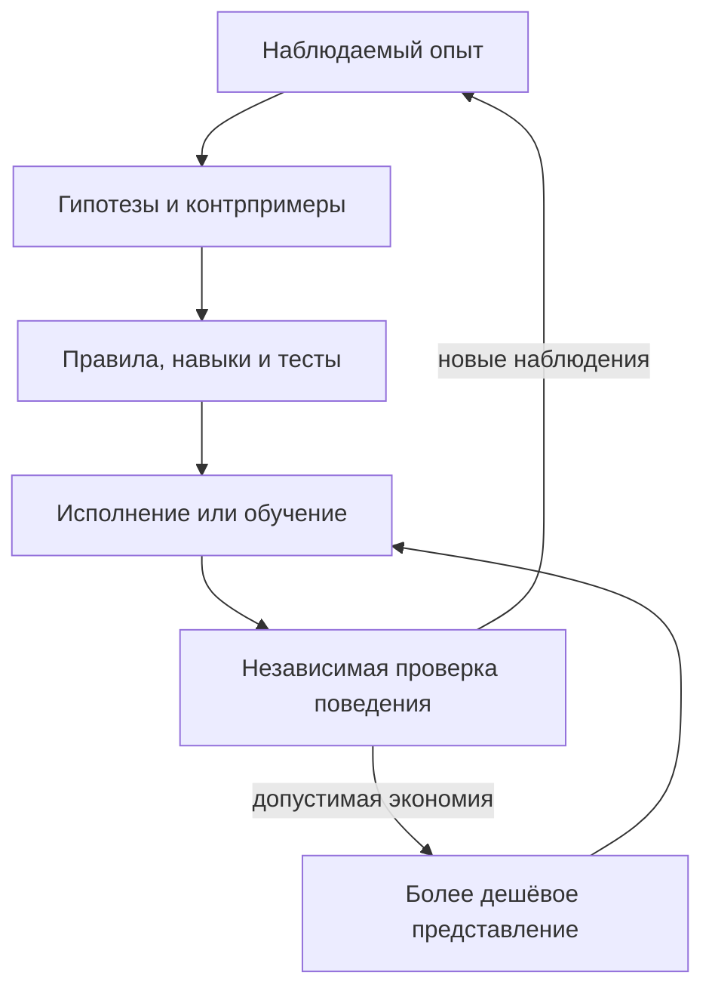

# AHSL 0.4 — формальная спецификация адаптивных агентных систем

**Дата:** 5 сентября 2026 года.  
**Статус:** итоговая предлагаемая семантическая редакция; заменяет AHSL 0.3.  
**Граница результата:** формальная модель, контракты, протокол оценки и требования к реализации. Полного компилятора, доказательства реализации и экспериментально подтверждённого преимущества AHSL пока нет.

## 1. Основное решение

AHSL описывает **адаптивную систему, действующую в среде при ограниченных полномочиях и ресурсах**, а также эксперимент, которым проверяют её свойства. Агент с замороженными весами — частный случай. Обучение памяти, весов, модели мира и самого алгоритма обновления должно описываться тем же языком.

Центральная единица — не промпт и не траектория, а **версионированный переход состояния с контрактом**. Траектории дают наблюдения для проверки и обучения. Компоненты реализуют переходы. Контракты задают допустимые эффекты. Протокол эксперимента определяет, какие улучшения действительно измерены.

У проекта три независимые задачи:

1. **Описание:** выразить устройство системы и её открытые интерфейсы.
2. **Исполнение:** контролировать доступ, ресурсы, версии, сбои и восстановление.
3. **Обоснование:** отличать формальную гарантию, результат измерения и гипотезу.

Способность описать систему не означает способность безопасно исполнять её или доказать её полезность. AHSL не обещает большей вычислительной выразительности, чем Python или функциональный язык. Его предполагаемая ценность — общая семантика сравнения, замены, наблюдения и контроля компонентов. Эту ценность ещё нужно подтвердить сравнением реализаций.

## 2. Решения итоговой редакции

| Вопрос | Норма 0.4 | Где определено |
|---|---|---|
| Что именно считается агентом? | Явная граница системы, сохраняемое состояние и условия сброса | §6.3, §7 |
| Что значит изменить себя? | Типизированный ChangeSet с проверкой прочитанных версий и области записи | §6.4 |
| Что значит приобрести навык? | Контракт поведения, реализация, установка и применение различаются | §8.3 |
| Когда изменение считается улучшением? | Отдельное утверждение с baseline, бюджетом, областью и неопределённостью | §17.4 |
| Можно ли сохранить пока слабую ветвь? | Экспериментальный архив отделён от допуска к исполнению и выпуска | §17.2 |
| Кто проверяет изменившегося оценщика? | Внешний протокол и независимые свидетельства | §18.5 |
| Что делать со старыми проверками? | Пересматривать их по зависимостям, а не по размеру patch | §18.5 |
| Где выгоднее хранить опыт? | Сравнивать явное, неявное и гибридное представления на одном протоколе | §8, §21 |
| Как избежать обязательного «умного контроллера»? | Фиксированное расписание является допустимым baseline | §17.2 |
| Чем язык лучше общего языка программирования? | Проверяемыми контрактами и сопоставимостью; преимущество требует измерения | §20, §23 |

## 3. Основания исследования и пять проверок проекта

Отправная точка — [favorite-papers/readme.md](https://github.com/vinnik-dmitry07/favorite-papers/blob/main/readme.md). В прочитанном снимке 349 пунктов и 272 уникальных arXiv ID. Это индекс для отбора источников, а не 349 полностью проверенных работ. Для этой редакции проверены первичные источники по тем вопросам, которые меняют семантику языка. Снимок README: SHA-256 `c607153a23804495eb015d6daff263cf683427dfc71205c198ac00613b6cdb4d`.

Ниже — пять проверяемых пересмотров проекта, а не изложение внутреннего процесса рассуждений.

| Проверка | Основание | Принятое проектное решение |
|---|---|---|
| 1. Что именно обучается? | [Nested Learning](https://arxiv.org/abs/2512.24695) рассматривает вложенные процессы оптимизации с разными потоками контекста | Состояние имеет владельца, правило обновления и временной масштаб; память не сводится к текстовой базе |
| 2. Что сохраняет конденсация? | [When Does Continual Learning Require Learning](https://arxiv.org/abs/2607.07847) сравнивает способы обновления при разных видах изменений среды | Экономия контекста, приобретение навыка, удержание старого и исправление нового измеряются отдельно |
| 3. Какой сигнал меняет поведение? | [SC-GRPO](https://arxiv.org/abs/2606.18810) и [SDPO](https://arxiv.org/abs/2601.20802) используют обусловленную обратной связью модель по-разному | Feedback, распределение кредита, обучающая цель и update rule — разные интерфейсы |
| 4. Что доказывают наблюдения? | [Evaluating the World Model](https://arxiv.org/abs/2406.03689) показывает ограничения обычных диагностик модели мира | Утверждение имеет область применимости, способ опровержения и статус подтверждения |
| 5. Что означает стабильность? | [Loss of Plasticity](https://github.com/shibhansh/loss-of-plasticity), исследования адаптивной оценки и семантика внешних эффектов | Проверяются безопасность исполнения, качество распределения результатов, восстановление и способность продолжать учиться |

Решения AHSL ниже — предлагаемая инженерная конструкция. Перечисленные статьи не доказывают её оптимальность и не задают обязательную архитектуру агента.

### 3.1 Сопоставление с новым обзором

Прочитаны основные разделы, алгоритмы, таблицы и обозначения [Self-Improvements in Modern Agentic Systems, v1](https://arxiv.org/html/2607.13104v1). Это обзор, а не экспериментальное доказательство превосходства единого harness. Его разделение параметров и внешней организации отображается в StateCell и Component; устойчивые изменения — в ChangeSet; навыки — в контракт и устанавливаемую реализацию. Обучение на собственном опыте и изменение собственного обновляющего кода различаются в SelfInductionRecord. Оценка относится к процессу при ограниченных ресурсах.

Мы не принимаем универсальные выводы о неуязвимости внешней памяти к забыванию, обязательной stateless-природе модели или непредставимости scaffold в расширенной RL-модели. Упорядоченные экспертные оценки свойств памяти не превращаются в измеренные метрики. Ни сохранение версии, ни улучшение внутреннего score не доказывают прогресс. Дальнейшие требования AHSL — самостоятельные проектные решения.

### 3.2 Аудит экспериментальных выводов и присланного Substack

Присланный пользователем разбор «When Does Continual Learning Require Learning» полезен как интерпретация. Универсальная необходимость определённого optimizer из него не следует. В [первичной статье](https://arxiv.org/html/2607.07847v1) есть существенные уточнения: агентные сравнения используют разные размеры моделей; GEPA на TempWiki не оптимизируется по стабильным фактам; в TempWiki-Easy часть деградации исчезает после изменения набора. Описанный там SDPO использует pairwise DPO, тогда как [исходный SDPO](https://arxiv.org/abs/2601.20802) дистиллирует предсказания модели, обусловленной feedback. Поэтому ярлык алгоритма не заменяет описание фактической реализации.

Из этого в AHSL следует обязанность регистрировать objective, переносимое состояние, reset policy, доступные данные, teacher и полную стоимость. Наблюдение «метод выиграл здесь» не получает тип «другие механизмы принципиально недостаточны». Такой вывод потребовал бы отдельного основания.

## 4. Нормативность и уровни соответствия

**MUST** означает обязательное требование выбранного профиля; **MUST NOT** — запрет; **SHOULD** — рекомендацию с документируемым исключением; **MAY** — возможность. Требования разделов ядра обязательны для заявленного соответствия ядру. Требования исследовательского профиля применяются только к этому профилю.

Утверждение о соответствии имеет вид:

```text
ConformanceClaim = {
  language_version, runtime_build, profile,
  implemented_features, evidence_refs,
  trusted_computing_base, assumptions, exclusions
}
```

Уровни не подменяют друг друга:

- `described`: разрешены ссылки, типы и структура описания;
- `mediated`: заявленные эффекты проходят через реальные точки контроля;
- `replayable`: журнал восстанавливает определённую проекцию состояния;
- `experimentally_evaluated`: выполнен указанный протокол оценки;
- `formally_verified[property, model, assumptions]`: доказано конкретное свойство конкретной модели или реализации.

Чёрный ящик MAY быть описан через адаптер. Его внутренние эффекты и состояние нельзя автоматически объявлять проверенными. Отчёт MUST перечислять непрозрачные границы. «Любой harness можно завернуть в один Python-вызов» недостаточно для структурной сопоставимости или сертификации.

## 5. Малое ядро и библиотека

Ядро фиксирует следующие сущности. Список исследовательских алгоритмов остаётся открытым.

| Сущность | Значение |
|---|---|
| `Value / ArtifactRef` | Типизированное значение либо ссылка на неизменяемое содержимое |
| `StateCell` | Версионированное изменяемое состояние |
| `Component` | Реализация вычисления с типами, эффектами и контрактом |
| `Invocation / Event` | Запрос перехода и запись его наблюдаемого исполнения |
| `Contract / Policy` | Условия, обязанности, полномочия и способы их проверки |
| `Claim / Evidence` | Утверждение и основания для его проверки |
| `UpdateRule` | Компонент, изменяющий разрешённое состояние по данным |
| `ExperimentProtocol` | Распределение задач, вмешательства, измерения и правила вывода |

Граф, агент, council, KNN, MAP-Elites, GEPA, decoder, optimizer, distillation и learned world model — библиотечные конструкции над ядром. Encoder и decoder являются типизированными преобразованиями. Модель — компонент с определённым интерфейсом доступа к состоянию. Метрика — компонент измерения с контрактом единиц и интерпретации.

Новый примитив ядра нужен, если без него нельзя выразить различие, необходимое для исполнения, контроля или проверки. Популярность библиотеки и человеческая практика — основания для проектирования удобного адаптера, но не доказательство необходимости нового семантического примитива.

## 6. Объект описания и семантика

Harness определяется кортежем

\[
H=(\mathcal T,\mathcal C,\mathcal S,G,\mathcal U,P,B_0,\mathcal O),
\]

где \(\mathcal T\) — типы; \(\mathcal C\) — компоненты; \(\mathcal S\) — ячейки состояния; \(G\) — программа управления; \(\mathcal U\) — правила обновления; \(P\) — политика; \(B_0\) — ресурсы; \(\mathcal O\) — контракт наблюдаемости. Протокол оценки \(\Pi\) задаётся отдельно.

Компонент со стохастическим поведением задаёт переходное ядро

\[
K_c:(I,S_{read})\longrightarrow
\mathcal P(O,\Delta S,\mathrm{EffectRequest},\mathrm{Usage}),
\]

где \(\mathcal P\) — пространство распределений, а \(\Delta S\) — **предложение** обновления локального состояния. Контроллер разрешает либо отклоняет эффекты; commit применяет допустимые изменения. Для потокового компонента один вызов раскрывается в последовательность таких взаимодействий. Эта математическая модель не требует, чтобы адаптер умел вычислять собственные вероятности.

Ядро исполнения моделируется через события:

\[
\Sigma_{t+1}=\operatorname{reduce}(\Sigma_t,e_t).
\]

`reduce` MUST быть детерминированным при фиксированных версии семантики, начальном состоянии и упорядоченных событиях. Выбор действия моделью, ответы сервиса, время, внешние изменения и решения планировщика входят через события. Повторное исполнение в мире и воспроизведение журнала — разные операции.

### 6.1 Контракт компонента

```text
Component = {
  id, implementation_ref, input_type, output_type,
  state_reads, state_writes, effect_schema,
  contract_ref, backend_requirements, observability
}

Contract = {
  precondition, allowed_effects, postcondition,
  resource_envelope, failure_semantics,
  assumptions, obligations, checker_refs
}
```

Условия MAY быть исполняемыми предикатами, формулами, статистическими требованиями или описанными обязанностями. Их тип MUST быть явным. Непроверенная формула не получает статус доказанной из-за нахождения в поле `postcondition`.

Для детерминированного компонента применима тройка Хоара \(\{Pre\}\,c\,\{Post\}\). Для вероятностного свойства указываются распределение и допустимая вероятность нарушения. Типовая корректность, доступность, качество и пользовательское намерение — отдельные свойства.

### 6.2 Композиция и замена

Последовательность требует совместимых типов. Предусловие следующего шага должно следовать из постусловия предыдущего либо проверяться runtime-предикатом перед запуском. Ошибка, отмена и неизвестный исход — отдельные ветви управления.

Замена \(c\) на \(c'\) допустима в конкретном контексте, если:

1. \(c'\) принимает все входы, обещанные \(c\), без усиления предусловия;
2. сохраняет требуемые постусловия и не расширяет разрешённые эффекты;
3. соблюдает тот же ресурсный предел либо получает новое разрешение;
4. проходит отдельные требования качества, если замена стохастическая или обучаемая.

Малое расстояние между весами, промптами или embedding-векторами не доказывает поведенческую эквивалентность. Локальная замена также не гарантирует сохранение качества всего feedback loop: необходимо проверить взаимодействие с окружением компонента.

### 6.3 Граница агента и жизненный цикл состояния

В исполнении различаются три объекта: конфигурация агента \(A_k\), его оперативное состояние \(x_t\) и внешнее состояние мира \(w_t\). Индекс \(k\) считает зафиксированные версии, \(t\) — события исполнения. Общее состояние runtime \(\Sigma_t\) содержит ссылки на эти объекты, журнал, активные вызовы и accounting; оно не тождественно агенту.

```text
AgentBoundary = {
  id, component_bindings, owned_cells, dependency_manifest,
  operational_cells, persistent_cells, reset_contract,
  mutable_targets, update_rule_bindings,
  external_services, opaque_boundaries
}
```

Конфигурация разрешает versioned bindings компонентов и значений. Код, промпт, веса, index, параметры decoder и updater могут входить в неё. Классификация по субстрату не определяет срок жизни: KV-состояние может сохраняться, а временные веса — сбрасываться.

`reset_contract` MUST задавать результат сброса для каждой ячейки и каждой объявленной границы: вход, эпизод, поток, рестарт. Долговременность утверждается только относительно названной границы. Изменение имени эпизода не считается приобретением знания. Внешний мир не сбрасывается вслед за локальной памятью без отдельного реализованного environment contract.

Долговременная адаптация означает, что изменение переживает заявленную границу и доступно будущему вычислению. Простая запись лога ещё не доказывает изменения способности решать задачи. Возможны адаптации с нулевым или отрицательным эффектом.

Граница MUST включать транзитивные зависимости изменяемой реализации либо перечислять непрозрачные зависимости. Смена endpoint, retrieval corpus или параметра декодирования является изменением зависимости, даже когда файл с системным промптом остался прежним.

### 6.4 Типизированное обновление и активация

```text
ChangeSet = {
  id, parent_manifest_ref, proposer_ref, updater_ref,
  read_versions, writes, dependency_refs,
  migration_ref, activation_boundary,
  policy_epoch, required_claims, evidence_refs
}

Write = Create(cell, type, value_ref)
      | Replace(cell, expected_version, value_ref)
      | Delete(cell, expected_version)
```

Область записи \(W(\Delta)\) — точное множество адресуемых ячеек. Для разрешённого локального перехода действует frame condition:

\[
\forall s\notin W(\Delta):\quad A_{k+1}[s]=A_k[s].
\]

Создание и удаление меняют явно перечисленные ячейки и ссылки реестра; dangling references запрещены. Неуказанное поле не исчезает и не заменяется default-значением. Преобразование схемы выполняется явной миграцией с условиями совместимости. Бинарные checkpoint сначала материализуются и проверяются; commit переключает ссылки на готовые артефакты.

`commit` MUST проверить в одной сериализуемой точке: актуальность прочитанных и заменяемых версий, типы, полномочия на область записи, policy epoch, целостность ссылок и действительность обязательных свидетельств. Проверка, выполненная до конкурентного изменения зависимости, не разрешает commit по устаревшему свидетельству. Конфликт требует нового предложения или явно проверенного merge. Атомарность локального commit не распространяется на внешние сервисы.

Начатый вызов закрепляет версию исполняемого компонента. Новая версия используется на объявленной границе активации; замена посередине вызова требует отдельного migration contract. Новая реализация update rule подчиняется тем же правилам. Самоссылка не добавляет прав.

Зафиксировать экспериментальный manifest, запустить его в разрешённой среде и назначить его рабочей версией — разные эффекты. Свидетельства качества требуются выбранным профилем активации; хранение неудачного результата не требует положительного результата теста качества.

## 7. Состояние, обучение и временные масштабы

```text
StateCell = {
  id, value_type, initial_value_ref, owner,
  readers, writers, update_rules,
  persistence, reset_boundary, conflict_policy,
  confidentiality, provenance_policy
}

UpdateRule = {
  component_ref, read_set, write_set,
  admissible_data, trigger, update_budget,
  objective_ref, credit_rule_ref,
  validation_contract, gradient_interface,
  stop_gradient_boundaries
}
```

`objective_ref` и `credit_rule_ref` MAY иметь значение `not_applicable` с объяснением: CRUD-обновление или случайная мутация не обязаны решать дифференцируемую оптимизационную задачу.

`persistence` и `reset_boundary` определяют, переживает ли значение шаг, эпизод, поток задач, рестарт процесса и публикацию версии. Частота обновлений сама по себе не является полномочием.

| Возможное состояние | Пример обновления | Что нужно фиксировать |
|---|---|---|
| Контекст и рабочая память | Retrieval, summary, REPL | Источники, отсечение, reset |
| Внешняя эпизодическая память | Добавление опыта, изменение utility | Происхождение, валидность, область задачи |
| Быстрое внутреннее состояние | Recurrent inference, fast weights | Поддержку backend, границы сброса |
| Параметры модели | SFT, RL, distillation, ES | Dataset lineage, objective, optimizer, compute |
| Состояние оптимизатора | Моменты, расписание, meta-parameters | Совместимость checkpoint и накопление |
| Модель мира | Новый переход, belief update | Наблюдение или симуляцию, неопределённость |
| Программа агента | Замена маршрутизации или кода | Версию, write set, проверку совместимости |
| Правило обновления | Поиск нового mutator/optimizer | Внешний протокол оценки самого learner |

Внутри эпизода веса MAY изменяться, если это предусмотрено разрешённым `UpdateRule`. При оценке замораживаются **правило адаптации, начальное состояние и разрешённый поток данных**, а не обязательно все веса на всём горизонте. Если правило адаптации само меняется, это допускается только явно описанным метаправилом. Цепь замыкается внешним неизменяемым на время эксперимента протоколом.

Такое описание позволяет задавать вложенные циклы обучения без объявления их эквивалентными. Вдохновение от Nested Learning не превращает произвольный prompt optimizer в градиентный optimizer.

## 8. Конденсация, формализация и перенос между представлениями

Исходную идею «явное → неявное → явное» полезно сохранить как исследовательскую программу, но разделить на четыре операции:

| Операция | Вход → выход | Чего она не гарантирует |
|---|---|---|
| `compress` | Трассы/текст → summary, индекс, compact representation | Приобретение нового навыка |
| `formalize` | Наблюдения/гипотезы → предикаты, программу, модель, тест | Истинность созданной формулы |
| `internalize` | Данные/навык/teacher → обученное состояние | Сохранение переноса и способности учиться |
| `externalize` | Поведение/модель → объяснение, правило, программу | Точное чтение причин или содержимого весов |

Текстовый summary остаётся явным артефактом. Latent state и параметры — разные виды неявного представления. Формализация может состояться вообще без изменения представления, например при добавлении проверяемых предусловий к существующей программе.

Рабочий цикл:



### 8.1 Контракт переноса поведения

Пусть \(A\) — исходный агент, а \(A'\) — результат сжатия, дистилляции, квантования либо компиляции навыка в код. На **объявленном** распределении \(D\) проверяются:

\[
\mathbb E_D[U(A)-U(A')]\leq\varepsilon,
\qquad
\Pr_D[V(A')=1]\leq\delta.
\]

\(U\) — определённая протоколом полезность; \(V\) — индикатор конкретного нарушения. Неравенства — цели проверки, а не гарантии оператора. В отчёте MUST быть метод оценки, доверительные границы, failure cases и ресурсный режим. Защищённые hard constraints проверяются отдельно и не «оплачиваются» ростом средней полезности.

Контракт SHOULD включать вмешательства: изменение ранее изученного факта, новую комбинацию навыков, удаление retrieval и восстановление после ошибки. Это проверяет, что перенеслось, а не только насколько похожи ответы.

Если \(C_{build}\) — стоимость преобразования, а \(c_A,c_{A'}\) — сравнимые средние стоимости применения, упрощённая точка окупаемости равна

\[
N_{break}=\frac{C_{build}}{c_A-c_{A'}},\quad c_A>c_{A'}.
\]

Все величины должны быть в одной выбранной единице. Обслуживание, обновление знаний и резервный retrieval добавляются в полную стоимость. Утверждение «дешёвое обучение лучше сложного harness» становится проверяемой гипотезой о качестве и окупаемости при данном числе будущих задач.

Самодистилляция требует проверки переноса: [Why Does Self-Distillation (Sometimes) Degrade Reasoning?](https://arxiv.org/abs/2603.24472) сообщает о случаях ухудшения OOD-рассуждений при улучшении внутри обучающего домена. Это основание для отдельного gate, а не доказательство неизбежного вреда дистилляции.

### 8.2 Скрытое вычисление

[Coconut](https://arxiv.org/abs/2412.06769) и [Scaling up Test-Time Compute with Latent Reasoning](https://arxiv.org/abs/2502.05171) мотивируют интерфейс внутреннего вычисления. Его реализация MUST объявить, доступны ли recurrent steps, hidden states, differentiable inputs и checkpointing. Закрытому текстовому API нельзя приписывать такой доступ.

Снижение внутренней энергии MAY быть stopping heuristic, если backend определяет эту энергию. [Energy Transformer](https://arxiv.org/abs/2302.07253) не даёт общей гарантии, что минимум энергии произвольного агента совпадает с истинным ответом, наградой или выполнением пользовательского контракта.

### 8.3 Навык: контракт, реализация, установка, применение

Навык задаётся следующими библиотечными типами; они не расширяют ядро:

```text
SkillContract = {
  input_type, output_type, applicability,
  required_capabilities, postcondition,
  resource_envelope, termination_or_timeout,
  failure_semantics, transfer_probes
}

SkillImplementation = {
  skill_contract_ref, artifact_refs, backend_requirements,
  dependency_versions, invocation_component_ref
}

SkillAcquisition = {
  experience_refs, transformation_ref,
  proposed_implementation_ref, installation_changeset_ref,
  validation_claims
}
```

`SkillContract` задаёт требуемое поведение. Реализация может быть программой, промптом с retrieval, adapter или обученным состоянием. Установка меняет конфигурацию; применение вызывает установленный компонент. Одна и та же программа установки MAY применяться к совместимым агентам, но повтор установки в одну конфигурацию имеет объявленную idempotency policy.

Навык решения действует на задачу; навык улучшения предлагает ChangeSet. Его результат также проверяется внешними для этого изменения правилами. Созданный инструмент получает только уже доступные вызывающему полномочия либо отдельно выданный grant. Наличие нового Python wrapper не расширяет доступ к среде.

Утверждение, что разные реализации выражают «тот же навык», относится к SkillContract и области проверенных входов. Совпадение названия или digest не доказывает поведенческую эквивалентность; разница digest не опровергает её. После смены зависимости совместимость и релевантные свидетельства пересматриваются.

Для цикла пользователя конденсация имеет два отдельных критерия: уменьшение стоимости представления и сохранение требуемого поведения. Формализация добавляет применимость, наблюдаемые последствия и способ опровержения. Обучение переносит выбранное поведение в конкретный субстрат. Удалять исходный reference book MAY только политика хранения; успех distillation сам по себе не требует такого удаления.

## 9. Артефакты, журнал и происхождение

### 9.1 Идентичность содержимого

Содержимое артефакта неизменяемо. Его digest вычисляется из однозначного кодирования `type_id`, `codec_id` и payload. Для бинарных payload используются точные байты и кодирование длин; для JSON-манифестов — фиксированная схема canonicalization.

В hash содержимого MUST NOT включаться текущий lifecycle status, подпись или hash события, которое само ссылается на результат. Это исключает циклическое определение идентичности.

```text
ArtifactRecord = {
  content_digest, type_id, codec_id, size_bytes,
  creation_event_id, direct_dependency_refs, access_policy
}

Event = {
  run_id, sequence, previous_event_digest, event_id,
  invocation_id, event_type, principal,
  input_refs, output_refs, state_versions,
  receipt_refs, usage, policy_version, observed_time
}
```

`event_id` назначается независимо от hash output. Запись события с output digest создаётся после появления payload. Подпись — отдельная аттестация уже определённого содержимого. Несколько событий могут породить одинаковое содержимое с разным provenance.

Для canonical JSON выбран [RFC 8785](https://www.rfc-editor.org/rfc/rfc8785). JCS не выполняет Unicode-нормализацию. Если предметной области она нужна, это отдельное явное преобразование до хеширования. Дубли ключей и невалидные значения отклоняются. Точные большие целые и десятичные величины кодируются схемой без неявной потери точности.

### 9.2 Журнал — запись наблюдений

Внутри одного журнала изменения control state линейризуются. Распределённый backend MUST либо обеспечить эту семантику, либо объявить иной профиль согласованности и собственные правила разрешения конфликтов. Зависимости между независимыми журналами задаются ссылками на события.

Наблюдаемый transcript содержит доступные сообщения, действия, ответы инструментов и метаданные. Он не является полным снимком скрытого рассуждения закрытой модели. Runtime MUST указывать наблюдаемые и недоступные части исполнения.

«В журнале записано, что инструмент сообщил X» не равнозначно «X истинно». Журнал защищает целостность и происхождение свидетельств в пределах модели доверия.

### 9.3 Хранение и забывание

Записанные события MUST NOT редактироваться как будто прошлое было другим. Retention policy MAY удалять payload, шифроключи либо недоступные по политике данные. После этого replayability и audit completeness пересчитываются; оставшийся digest не восстанавливает удалённое содержимое.

«Хранить каждый эксперимент навсегда» не является обязательным инвариантом. Важны объявленные сроки, контролируемое удаление, доступность оснований значимых выводов и стоимость хранения.

## 10. Внешние эффекты, сбои и транзакции

Для каждого вызова раздельно хранятся:

```text
LocalStatus = planned | reserved | submitted | observed | committed | aborted
ExternalStatus = not_started | pending | confirmed | confirmed_absent | unknown
```

Транспортная ошибка не определяет результат внешнего действия. `aborted` означает отказ от локального commit; внешний эффект при этом может быть `confirmed` или `unknown`.

Минимальный протокол:

1. Проверить вход, актуальные capabilities, версии состояния и верхние ресурсные пределы.
2. Атомарно зарезервировать ресурсы и записать допуск в устойчивый журнал.
3. До передачи внешнего запроса записать `DispatchIntent` с invocation ID и request digest.
4. Выполнить запрос через контролируемый broker с поддерживаемой политикой повторов.
5. Сохранить receipt либо факт потери достоверного ответа.
6. Провести postcondition checks; атомарно применить разрешённые локальные записи с проверкой версий.
7. Завершить ресурсный расчёт по подтверждённому или консервативному начислению.

Падение после `DispatchIntent` и до сохранения receipt приводит к `unknown`, даже если запрос мог ещё не уйти. Консервативная неопределённость предпочтительнее выдуманного результата.

### 10.1 Повторы

Каждая потенциально повторяемая операция объявляет один режим:

- `pure`: повтор не имеет внешнего изменяющего эффекта;
- `provider_idempotent`: провайдер дедуплицирует одинаковый ключ и проверяет неизменность запроса в заданном окне;
- `reconcilable`: статус устанавливается отдельным достоверным запросом;
- `nonrepeatable`: автоматический повтор неизвестного исхода запрещён.

Одинаковый invocation ID с другим request digest MUST быть отклонён. Нельзя создавать новый ID, чтобы обойти запрет повтора неизвестного исхода. Повтор после `confirmed_absent` допустим только если контракт исключает позднее исполнение первоначального запроса либо использует пригодный fencing/idempotency mechanism.

Provider idempotency — конкретное обязательство сервиса, не свойство строки `idempotency_key`. Практические условия этого подхода разобраны в [AWS Builders’ Library](https://aws.amazon.com/builders-library/making-retries-safe-with-idempotent-APIs/).

### 10.2 Откат и компенсация

Rollback MAY восстановить локальный snapshot, если записи изолированы и нет уже опубликованных зависимых изменений. Компенсация внешнего эффекта — новое действие со своими правами, стоимостью и вероятностью отказа. Она не стирает историю и не обещает точное восстановление мира.

Конфликт локального commit после внешнего успеха MUST сохранять receipt и внешний статус. Такой вызов нельзя объявить «ничего не сделал».

## 11. Ресурсы, конкурентность и завершение

Для каждого аддитивного ограничиваемого ресурса \(j\):

\[
G_j=S_j+R_j+A_j,\qquad S_j,R_j,A_j\geq0,
\]

где \(G\) — выдано, \(S\) — начислено, \(R\) — зарезервировано, \(A\) — доступно. Дополнительная выдача — отдельное авторизованное событие.

- Reserve \(r\): \(A'=A-r, R'=R+r\), только если \(r\leq A\).
- Settle \(r,c\): \(S'=S+c, R'=R-r, A'=A+r-c\), если \(0\leq c\leq r\).
- Неизвестная стоимость: резерв сохраняется либо консервативно начисляется его верхняя граница.

Потраченная работа не возвращается при отказе результата. Возврат свободного резерва увеличивает `available` без нарушения инварианта. Финансовый refund оформляется отдельной корректировкой/выдачей; история расхода не переписывается.

Жёсткий лимит осуществим, только если backend обеспечивает верхнюю границу операции или runtime умеет остановить её до превышения. Без этого лимит MUST называться оценочным; billing lag нельзя скрывать формулой.

Дочерний процесс получает подбюджет из родительского резерва. Иерархическое представление MUST исключать двойное начисление одной работы. GPU-seconds и токены могут суммироваться; elapsed wall time параллельных ветвей не суммируется как длительность эксперимента. Память, число concurrent slots и deadline имеют отдельную семантику ограничений.

Конфликтующие записи используют CAS по версии, сериализацию либо явно объявленный merge. Даже математически коммутативный merge данных не разрешает расширять capabilities. Выигрыш race-ветви не отменяет уже совершённые эффекты проигравших.

Завершение живого процесса гарантируется только при объявленных предпосылках: доступный scheduler, исполняемый deadline, возможность прерывать локальную работу и ограниченность очередей. Run MAY завершиться классификацией `unresolved_external_effect`; фоновые reconciliation actions имеют отдельный бюджет. Неизвестный исход не обязан стать известным за конечное время.

## 12. Полномочия и доверенная граница

Capabilities задают операции над конкретными ресурсами, параметры, срок действия и ограничения делегирования. Prompt, summary, retrieved document, checkpoint и голосование сами по себе не создают capability.

Обычное делегирование MUST сужать полномочия родителя. Вызов привилегированного сервиса — другой случай: вызывающий имеет право на узкий метод сервиса, а сервис действует со своими полномочиями, проверяя запрос и фильтруя выход. Например, право получить score не даёт право читать hidden tests. Такое разделение защищает от confused-deputy только при реально реализованных проверках метода.

Политика должна контролировать доступ в местах, где он происходит: файловая система, credentials, tools, сеть, provider-side tools, spawned workers и сервисы. Декларация `effects: []` не изолирует произвольный Python-код.

TCB MUST перечислять доверенные элементы: broker, policy evaluator, store, sandbox/hypervisor, исполняемые проверяющие компоненты, используемые сервисные гарантии. Формальный вывод об отсутствии запрещённых эффектов условен относительно полноты mediation и корректности TCB. Он не доказывает отсутствия неучтённых каналов, дефектов реализации или неверно сформулированной цели.

### 12.1 Три независимых измерения данных

1. **Доступ:** кто может читать и передавать содержимое.
2. **Происхождение:** реальное наблюдение, сообщение источника, симуляция, синтетический пример, ручная разметка.
3. **Подтверждение:** какой claim проверен, каким способом и при каких предпосылках.

Подпись подтверждает происхождение в рамках доверия к ключу, а не истинность. Derivation не повышает достоверность без проверки. Сжатие и обучение не снимают ограничения использования исходных данных: derived artifacts, включая веса, получают консервативную provenance/access policy либо отдельное обоснование разрешённого выпуска. AHSL не обещает точную побитовую атрибуцию обучения.

Статистическая independence между двумя reviewer не следует из разных имён, personas или API-вызовов. Общие модель, данные и источники MUST быть видимы в отчёте при обосновании ансамбля.

## 13. Намерение, спецификация задачи и модель мира

Слово «спецификация» требует разделять разные сущности:

| Сущность | Содержание | Как изменяется |
|---|---|---|
| `IntentRecord` | Цели, приоритеты, допустимые компромиссы и неясности | Через уполномоченную процедуру изменения требований |
| `ExecutableContract` | Проверяемые входы, выходы, инварианты и ограничения | Версионированным изменением контракта |
| `OperationalPlan` | Текущий способ выполнить задачу | Внутри разрешённой адаптации |
| `WorldHypothesis` | Предположение о том, как устроена среда | По наблюдениям и опровержениям |

`Task → Specification` не является гарантированно корректной компиляцией естественного языка. Результат MUST сохранять unresolved assumptions и связывать требования с проверками. Для каждого существенного требования нужен статус: проверено формально, покрыто тестом, оценено статистически либо пока неоперационализировано.

При противоречии цели и проверяющего теста агент MAY предложить defect report или новую версию требований. Он MUST NOT считать самовольное ослабление теста выполнением исходной задачи. Разрешённое изменение цели — обычная управляемая операция с отдельной authority; она не обязана требовать человека на каждом шаге, если полномочия заранее делегированы.

Фиксированность certification protocol защищает сопоставимость, но не делает плохую метрику хорошей. Reliability оценщика, соответствие целевой конструкции и последствия оптимизации его score проверяются отдельно. Это согласуется с различениями в [RIFT](https://arxiv.org/abs/2604.01375). Изоляция evaluator предотвращает один класс вмешательств, а не все формы reward hacking.

## 14. Утверждения, память и отрицательный опыт

```text
Claim = {
  statement_ref, scope, assumptions, valid_time,
  support_refs, counterevidence_refs,
  verification_method, status, uncertainty
}

Measurement = {
  target, metric_ref, population_scope, units,
  estimator, value_or_unknown, uncertainty,
  sample_unit, observation_refs
}
```

`status` различает `proposed`, `tested`, `supported_in_scope`, `refuted_in_scope`, `superseded`, `unknown`. Доказанное формальное утверждение получает отдельную ссылку на theorem, assumptions и проверяющую систему. Нельзя повышать status большинства голосов до математической истинности.

Любое поле вроде `compression_loss`, `coverage`, `confidence` или `novelty` MUST иметь определение измерения. Если измерения нет, используется `unknown`, а не произвольное число. Faithfulness summary относительно источника отличается от полезности summary для задачи.

Память MAY иметь raw, episodic, semantic, procedural, learned и index-представления. У каждого производного элемента сохраняются источники, область применимости, версия трансформации, время и опровержения. Индекс можно перестраивать; перестройка не переписывает происхождение данных.

Отрицательный банк хранит минимум:

```text
FailureRecord = {
  attempted_intervention, task_and_environment_version,
  preconditions, outcome, evidence_refs,
  alternative_explanations, applicability_scope,
  expiry_or_recheck_rule
}
```

Неудачный эксперимент означает «при этих условиях получен такой исход», а не «идея невозможна». Повтор может быть рационален после изменения условия, уменьшения неопределённости или устранения сбоя. Дедупликация SHOULD различать идентичный бесполезный повтор и намеренную репликацию.

### 14.1 Retrieval и поток идей

Retrieval policy задаётся отдельно от физического индекса. Возможна смесь

\[
q(d\mid h)=\lambda_r q_{relevance}(d\mid h)
+\lambda_n q_{novelty}(d\mid h)
+\lambda_c q_{counterevidence}(d\mid h),
\quad \lambda_i\geq0,\ \sum_i\lambda_i=1.
\]

Это распределение над допустимыми документами после access filtering, а не обязательная формула ranking score. Реализация фиксирует нормализацию, fallback при пустом наборе и версию политики. Для иерархического reference book задаются операции `search`, `expand`, `parent`, `neighbors`, budget и правила остановки; пропорция 20/80 не является инвариантом.

В журнал входят запрос, версия индекса, выбранные IDs, доступные score, объём возвращённого и реально переданного в контекст материала, latency и стоимость. Runtime не обязан логировать скрытое содержание, если это запрещено политикой.

Нужно различать:

- случайность sampling;
- разнообразие поведения;
- новые внешние сведения;
- неопределённость гипотез;
- поиск опровержения.

Шум в embedding может увеличить разнообразие, но не гарантирует информацию или прогресс. Статья не становится «источником энтропии» в строгом информационном смысле без определения случайной величины. Полностью unbiased internet search не обещается: объявляются источники, критерии включения, исключения, дедупликация и конфликтующие свидетельства.

Постоянный поток идей реализуется producer/queue/consumer с backpressure и лимитами. Иначе система оптимизирует скорость накопления непроверенных текстов. Обязательный выход для принятой идеи — предложенный эксперимент с ожидаемой стоимостью и способом отличить успех от неуспеха; для грубой случайной мутации объяснение механизма MAY быть неизвестным.

## 15. Модель мира и планирование

История \(h_t=(o_0,a_0,\ldots,a_{t-1},o_t)\) содержит наблюдения и действия. Environment adapter не обязан раскрывать истинное состояние. Агент может поддерживать belief state \(b_t\) и приближённую модель

\[
\widehat P(o_{t+1},r_t\mid h_t,a_t).
\]

Контракт модели мира определяет observation/action schemas, horizon, task scope, uncertainty interface, процедуры обновления и проверки. Полная детерминированная симуляция — специальный случай, а не требование к любой среде.

Формализация гипотезы создаёт предсказание. Проверка сравнивает его с независимым наблюдением. В стохастической среде одно несовпадение не опровергает всё распределение: используются объявленные scoring rules, интервалы или hypothesis tests. Для детерминированного закона допустим точный контрпример.

Два представления состояния могут объединяться по модели только в пределах выбранного критерия предсказательной эквивалентности. Идеальный критерий требует одинаковых распределений будущих наблюдений для всех допустимых продолжений действий. Практический тест проверяет лишь конечное семейство продолжений и MUST сообщать этот предел.

Модель, удачная на обычных next-step predictions, может проваливаться при вмешательствах или длинных комбинациях. Проверки SHOULD включать контрфактические действия, повторяемость переходов в одинаковых условиях и новые композиции. Работа [Robust Agents Learn Causal World Models](https://arxiv.org/abs/2402.10877) даёт результат при конкретных предпосылках о сдвигах и regret; из неё не следует обязательность одного универсального причинного графа в любом harness.

Типы `ObservedTransition` и `SimulatedTransition[model_version]` различны. Обучение на симуляции MAY быть разрешено, но этот источник MUST сохраняться в lineage. Сертификация реального выполнения требует real-world evidence или явно обоснованного transfer contract. Сама симуляция не может выпустить его себе.

[Q-Learning With World Models](https://arxiv.org/abs/2608.17163) иллюстрирует полезное разделение: воображаемые переходы применяются для поиска при выполнении, а Q/policy обучаются на реальных переходах. AHSL позволяет описать такое ограничение данных, не навязывая его всем model-based алгоритмам.

## 16. Feedback, credit assignment и обновления

Обучающий pipeline разделяет:

```text
Observation -> Feedback -> CreditAssignment -> Update -> Validation
```

`Feedback` содержит результат, текстовую критику, подтверждённые ограничения и происхождение. `CreditAssignment` оценивает связь между частями опыта и сигналом. `Update` меняет состояние. Причинная интерпретация credit assignment требует собственных оснований: attribution от LLM не является причинным доказательством.

Нужно отдельно описывать prospective value — оценку будущего действия — и retrospective credit — объяснение уже полученного результата. Их можно вычислять одной моделью, но нельзя смешивать типы выводов.

| Метод | Объект изменения | Роль обратной связи |
|---|---|---|
| [GEPA](https://arxiv.org/abs/2507.19457) в исходной постановке | Промпты компонентов | Рефлексия над выполнением и оценками предлагает кандидата |
| KNN/reference book | Доступный контекст и внешнее состояние | Выбор релевантного или полезного опыта |
| [SDPO](https://arxiv.org/abs/2601.20802) | Параметры policy | Обусловленная feedback teacher-модель задаёт distillation signal |
| [SC-GRPO](https://arxiv.org/abs/2606.18810) | Параметры policy | Обусловленные собственными решениями распределения участвуют в token-level credit weighting |
| Learned memory utility | Параметры retrieval/value rule | Опыт обновляет оценку полезности извлечения |

KNN с хорошими решениями не становится SC-GRPO: для этого требуются соответствующая обучающая цель и изменение параметров. GEPA использует траектории как свидетельства; это не означает редактирование фактически произошедшей истории. Его reflective mutation остаётся gradient-free; название «first-order» здесь нельзя интерпретировать как наличие градиента.

Любая supervised/RL/self-distillation реализация MUST объявить: данные и их происхождение, teacher и student versions, objective, sampling policy, какие параметры обновляются, optimizer state, stop-gradient boundaries, обработку all-fail/all-success групп и пределы compute. Backend, предоставляющий только текстовый inference, не удовлетворяет weight-training interface.

### 16.1 Операторы эволюции как независимые оси

```text
SearchProposal = {
  parent_refs, target_write_set,
  feedback_sources, proposal_mechanism,
  change_scale, diversity_objective,
  expected_effect_or_unknown, evaluation_plan
}
```

| Ось | Примеры значений |
|---|---|
| Что меняется | Prompt, code, memory, weights, routing, mutator |
| Какая информация используется | Никакая task feedback, scalar outcome, traces, critique, gradients |
| Как строится предложение | Perturbation, crossover, distribution fitting, distillation, synthesis |
| Насколько велико изменение | Local edit, structural edit, restart/hypermutation |
| Что поощряет поиск | Quality, novelty, robustness, information gain |
| Кто предлагает | Одна модель, несколько независимых кандидатов, Delphi rounds |

Поэтому hypermutation, novelty, Lamarckian и self-referential mutation не образуют взаимоисключающий список. Один оператор может быть одновременно reflective, novelty-seeking, structural и направленным на mutator. Adversarial search создаёт контрпримеры или проверочные воздействия; это не обязательно изменение полезного candidate.

MAP-Elites — способ организации архива и отбора по behavioral descriptors. TRIZ — возможная библиотека преобразований и противоречий для генератора. Ни то ни другое не требует отдельного opcode ядра. Использование конкретной TRIZ-библиотеки потребует проверки её интерфейса; здесь не утверждается, что какой-либо репозиторий уже реализует AHSL.

Редактирование transcript MAY создавать `SyntheticTrajectory` или counterfactual proposal. Исправленный текст MUST NOT получать происхождение реального исполнения. Кандидат в политику проверяется новым выполнением либо допустимым offline evaluation contract с явными предпосылками.

### 16.2 Происхождение обучающего сигнала и самоучастие

```text
LearningSignal = {
  content_ref, use_roles, source_refs,
  producer_version, environment_version,
  grounding: observed | simulated | inferred | mixed,
  verifier_refs, verification_scope,
  access_policy, label_availability_time
}

SelfInductionRecord = {
  agent_boundary_ref, experience_policy_ref,
  proposal_producer_ref, update_executor_ref,
  update_rule_changes, external_input_refs
}
```

`use_roles` MAY включать demonstration, outcome, preference, critique, counterexample и exploration. Эти роли не взаимоисключающие. Сгенерированная агентом задача может проверяться внешним исполнителем; реальная траектория может иметь ошибочную оценку learned critic. Источник, использование и надёжность сигнала — разные поля.

SelfInductionRecord фиксирует независимо, кто определял опыт, кто предложил изменение, кто выполнил обучение и менялся ли сам updater. Это относится как к параметрам, так и к внешним компонентам. Внешний teacher или помощь человека указываются как вход и стоимость; их наличие не превращает остальные собственные изменения агента в фиктивные.

`UpdateRule` MUST разрешаться в implementation manifest с objective, code revision и полным backend configuration. Неоднозначные названия вроде SDPO недостаточны. Изменение loss, teacher conditioning, reset policy или sampling образует отдельный вариант метода.

Согласованность ответов и высокая уверенность MAY направлять поиск. Они MUST NOT автоматически получать статус подтверждённого результата. Для синтетического опыта указывается набор проверок против наблюдаемой среды; общий генератор данных и critic не создают независимого подтверждения друг друга.

Поиск novelty, изменение retrieval и интернет-поиск имеют отдельные budget и provenance. Предсказательная ошибка MAY быть proxy интереса, но её рост на случайном шуме не считается улучшением навыка. Любой learned allocator сравнивается с простым расписанием при учёте стоимости самого выбора.

## 17. Решения, councils и самосовершенствование

### 17.1 Типизированная агрегация

```text
DecisionContract = {
  question_type, admissible_inputs, aggregation_rule,
  dependence_assumptions, tie_rule, abstention_rule,
  output_type, decision_authority, validation_method
}
```

`question_type` различает предсказание факта, оценку кандидата, коллективное предпочтение и распределение ресурса. Среднее вероятностей, ранговое голосование, veto по ограничению и синтез текста имеют разную семантику. Их унификация — общий интерфейс с разными предпосылками, а не одна универсальная функция голосования.

Для фактов consensus является сигналом, требующим калибровки. Для коллективных предпочтений объявленное правило голосования может быть самой процедурой решения. Агрегатор не выдаёт себе дополнительные права из числа согласившихся агентов.

В профиле исследовательской оптимизации Delphi MAY предлагать consensus candidate, dissenting candidates и discriminating experiment. Вызов нескольких моделей должен сравниваться с равным бюджетом независимого sampling и обычной рефлексии. Обязательное включение council и фиксированная доля 70/20/10 исключены из нормы: это гиперпараметры эксперимента.

### 17.2 Поиск, распределение бюджета и отбор

Генерация кандидатов, выбор следующего эксперимента, обучение, archive update и release — разные операции. Их реализации могут быть объединены программно, но эффекты и полномочия остаются различимы.

Контроллер выбирает между дополнительным наблюдением, повтором, новой гипотезой, обучением, упрощением и остановкой. Его цель MAY учитывать ожидаемое улучшение и стоимость; value of information — оценка с неопределённостью, а не автоматически доступное число. Минимальная реализация использует фиксированное расписание и явный budget allocator.

Кандидат определяется immutable manifest и начальным состоянием. Обновление cell создаёт новую версию; membership в archive и deployment status хранятся отдельно от content hash. Pareto selection не доказывает общую оптимальность за пределами просмотренных кандидатов и измеренных метрик.

Профиль поиска различает `retain_experimental`, `activate_research`, `release` и `reject`. Сохранённый кандидат MAY быть слабее родителя по основной метрике и полезен для дальнейшей ветви. Допуск к экспериментальному запуску всё равно требует типов, полномочий и ресурсов. `release` требует полного release contract. Решение `reject` не удаляет факт попытки и её затраты.

[Darwin Gödel Machine](https://arxiv.org/abs/2505.22954) использует архив для поиска промежуточных агентов. В AHSL это мотивирует разделение архива и выпуска, а не обязательный выбор конкретного эволюционного алгоритма.

### 17.3 Оценка learner и meta-learner

Объект оценки адаптивного агента:

\[
L=(H_0,x_0,U,\mathcal D_{allowed},B).
\]

Оценивается траектория результатов **всего** \(L\) на потоке задач, а не только лучший конечный snapshot. В стоимость входят неудачные пробы, подготовка данных, обучение и выбор победителя.

Для оценки meta-learner внешний эксперимент фиксирует набор потоков задач, бюджеты и правила доступа. Meta-learner MAY менять внутренний update rule, но не свой внешний критерий, hidden data или учёт затрат. Shared base model для proposer/solver/critic допустима; изоляция authority не требует разных нейросетей.

«Recursive self-improvement» в отчёте требует показать улучшение последующего процесса улучшения на новых задачах при сопоставимых ресурсах. Саморедактирование кода или рост одного benchmark score этого не устанавливают.

Agent MAY завершить собственную попытку и вернуть failure/abstention. Это не даёт права отменить внешний эксперимент, стереть неудачу или самостоятельно объявить её успехом.

### 17.4 Формальное утверждение об улучшении

```text
ImprovementClaim = {
  subject: snapshot | learner | meta_learner,
  candidate_ref, baseline_ref, protocol_ref,
  task_scope, resource_regime, primary_estimand,
  practical_margin, uncertainty_method,
  constraint_claims, evidence_refs
}
```

Для snapshot проверяется поведение зафиксированной конфигурации. Для learner проверяется алгоритм с начальным состоянием и допустимыми обновлениями на целом потоке. Для meta-learner проверяется механизм изменения learner. Смешивать эти объекты в одной оценке MUST NOT.

Пусть \(J_\Pi(L;B)\) — математическое ожидание заранее выбранной функции результатов learner \(L\) в протоколе \(\Pi\) при ресурсе \(B\). Функция может быть terminal quality, интегралом learning curve или полезностью всего потока; выбор фиксируется до просмотра результатов. Для сравнения:

\[
\Delta_\Pi(L',L;B)=J_\Pi(L';B)-J_\Pi(L;B).
\]

Эмпирическое утверждение об улучшении требует

\[
\operatorname{LCB}_{1-\alpha}(\Delta_\Pi)>\eta,
\]

где \(\eta\ge0\) — минимальный практически значимый прирост, а метод построения границы соответствует дизайну эксперимента. Дополнительно выполняются risk bounds и guardrails. Non-inferiority использует заранее заданный предел \(-\varepsilon\); она не переименовывается в прирост качества. Для экономии compute допустимо отдельное утверждение: non-inferiority качества и улучшение стоимости.

Регистрация изменения устанавливает факт адаптации; прохождение формального инварианта — допустимость в его модели; положительный development score — основание для отбора. Только надлежащая проверка устанавливает ImprovementClaim в указанной области. Ни один статус не означает универсального или бесконечного роста.

Чтобы заявлять улучшение алгоритма улучшения \(U\), сравниваются \(L_{U'}\) и \(L_U\) на новых независимых потоках с сопоставимыми начальными условиями и бюджетом. Стоимость поиска самого \(U'\) раскрывается отдельно и включается в total-cost claim. Улучшение одной конечной модели без такого сравнения не подтверждает рекурсивный прирост.

## 18. Протокол эксперимента и статистические требования

```text
ExperimentProtocol = {
  task_distribution, stream_ordering, split_policy,
  initial_state_distribution, reset_policy,
  allowed_adaptation, information_release_policy,
  evaluator_versions, metrics, resource_regime,
  interventions, comparison_design,
  stopping_rule, inference_method, release_rule
}
```

### 18.1 Три роли оценки

- **Training feedback:** доступен learner; critic, reward model и curriculum могут обучаться.
- **Development evaluation:** используется для выбора идей и кандидатов; считается частью поиска.
- **Certification evaluation:** проверяет заявленный результат на внешнем протоколе; доступ и число запросов контролируются.

Разрешённое online learning в certification — часть задачи. Получение скрытых oracle labels для обучения не разрешается автоматически; information release policy задаёт, что и когда видит learner.

Версии `policy`, `evaluation_protocol`, `environment`, `candidate`, `dataset` и `runtime` независимы. Новая модель при том же протоколе не создаёт новую эпоху benchmark. Если меняется протокол, сравнение возможно на общей зафиксированной bridge-suite с явным ограничением вывода.

### 18.2 Метрики

Для каждого режима и распределения задач публикуются:

Вероятности и ожидания ниже включают случайность задач, среды, начального состояния и agent sampling, предусмотренную протоколом. Выборка должна воспроизводить именно эту целевую меру; один фиксированный seed её не заменяет.

\[
R=\Pr(\text{task success}\land\text{hard constraints satisfied}),
\]

\[
\widetilde U=
\begin{cases}
U\in[0,1],&\text{валидный измеренный исход},\\
u_{failure},&\text{ошибка, timeout или иной исход по failure policy}.
\end{cases}
\]

`u_failure` задаётся до запуска; для неуспеха обычно 0. Нельзя исключать ошибки реализации или неудачные попытки из знаменателя из-за отсутствия красивого output. Неполнота телеметрии требует отчёта missingness; если истинный outcome не установлен, показывается консервативная граница или заранее обоснованная missing-data procedure.

Нижний хвост определяется через квантильную функцию, включая атомы распределения:

\[
\operatorname{LowerTail}_q(\widetilde U)
=\frac1q\int_0^q F_{\widetilde U}^{-1}(v)\,dv.
\]

Это средняя полезность худшей доли исходов с корректным частичным весом границы. Hard violations дополнительно публикуются по типу и тяжести и не скрываются средним score.

Ресурсный результат — вектор, например `(input_tokens, output_tokens, tool_calls, gpu_seconds, elapsed_seconds, peak_bytes, currency_cost)`. Складывать токены с секундами нельзя. Скалярная стоимость допустима при явном преобразовании единиц; hard budget constraints сохраняются.

Recovery измеряет восстановление требуемого состояния/способности в пределах бюджета после объявленного **восстановимого** сбоя. Это отличается от повторного получения хорошего ответа. Отдельно учитываются повторные внешние эффекты, незакрытые неопределённые исходы и время до согласованного состояния.

### 18.3 Независимость, выбор и адаптивность

Sample unit MUST соответствовать обобщению: задача, семейство, поток задач или независимая обучающая история. Повторные rollouts одной задачи оценивают внутритасковую вариативность; они не заменяют множество независимых задач. Для адаптивного learner основной единицей часто является весь поток со сбросом начального состояния.

Сравнение SHOULD быть парным по задачам/потокам. Общие seeds применяются лишь там, где семантика случайности сопоставима. Bootstrap или модель ошибок должны учитывать кластеризацию по задачам/потокам. Нельзя применять формулу для iid rollout к зависимым шагам одной траектории.

При нуле наблюдённых нарушений на \(n\) iid Bernoulli trials односторонняя точная верхняя граница вероятности нарушения равна

\[
p_{upper}=1-\alpha^{1/n}.
\]

Для \(\alpha=0.05\), чтобы эта граница была ниже 1%, нужны минимум 299 таких trials. Это не доказательство нулевого риска и не гарантия на неизвестных семействах задач.

Адаптивное многократное обращение к holdout раскрывает информацию даже через pass/fail. Протокол MUST выбрать реализуемое решение: однократная финальная проверка, свежие независимые batches, заранее заданная correction/query policy либо обоснованный reusable-holdout mechanism. См. [Generalization in Adaptive Data Analysis and Holdout Reuse](https://arxiv.org/abs/1506.02629).

При необязательном заранее размере выборки допустимы [confidence sequences](https://arxiv.org/abs/1810.08240) с выполненными предпосылками. Они не исправляют автоматически смену кандидата, утечку holdout и зависимость данных. Для повторных release tests задаётся общий error budget и правило его расходования.

Publication MUST включать все ресурсы поиска, количество кандидатов, правила отбора, остановки и исключений. `best-of-N` без N и полной стоимости не является сравнением эффективности.

### 18.4 Допуск обновления

В профиле `research_release` обновление проходит последовательно:

1. соответствие типов, политик, ресурсных ограничений и обязательных проверок;
2. удовлетворение заданным risk/reliability bounds;
3. статистический критерий улучшения либо non-inferiority на целевых задачах;
4. guardrails удержания навыков, переноса и актуализации знаний;
5. явную версию deployment manifest и возможность локального восстановления совместимого состояния.

«Нет статистически значимого ухудшения» не означает доказанную non-inferiority. Пределы \(\varepsilon,\delta\), правила сравнений и выбор primary metric MUST быть заданы заранее. Улучшение Pareto-frontier и выпуск единственного кандидата — разные решения.

### 18.5 Эволюция critic и срок действия свидетельств

```text
EvidenceCertificate = {
  claim_ref, subject_ref, protocol_ref,
  evidence_refs, checker_version,
  dependency_versions, dependency_scope_complete,
  assumptions, applicability, expiry_rule,
  status: current | stale | revoked | unknown
}
```

Пусть \(D_c\) — замыкание зависимостей свидетельства, \(C_\Delta\) — множество изменённых зависимостей. Свидетельство MAY сохранять применимость, только если замыкание известно, версии совпадают, предпосылки продолжают выполняться и

\[
D_c\cap C_\Delta=\varnothing.
\]

Иначе оно требует повторной проверки или обоснованного переноса. Пустое поле зависимостей не является доказательством независимости. Неизвестная полнота получает `unknown`, а не `current`. Этот критерий относится к каждому утверждению отдельно: старые наблюдения остаются историческими данными даже после утраты применимости к новому кандидату.

Сертификат качества конкретных весов обычно зависит от этих весов. Доказательство conservation в изолированном broker может от них не зависеть. Сертификат learner MAY охватывать разрешённый класс последовательных обновлений, если они входят в проверенный протокол; тогда штатный шаг не является произвольной сменой объекта проверки. Если результат касается только snapshot, такое расширение запрещено.

Training critic MAY исправлять собственные правила. Положительный score новой версии critic не сертифицирует саму эту версию. Её выпуск требует независимой проверки в заявленной области: калибровки, ложных допусков/отказов и известных контрпримеров. Разные названия моделей не доказывают независимости ошибок. Все затраты и версии judge, rubric, контекста и доступных инструментов учитываются.

Добавление проверки может уменьшить множество допускаемых решений, но не гарантирует правильности нового ограничения: ошибочный тест способен запретить все корректные решения. Поэтому append-only critic не является универсальной нормой. Изменение внешнего критерия создаёт новую версию протокола; оно не переписывает прежние результаты и не служит способом повысить собственную оценку.

### 18.6 Совместные изменения и причинное сравнение

Для совместной смены весов \(\theta\) и внешней организации \(s\) полезен факторный эксперимент:

\[
Y_{ij}=J_\Pi(\theta_i,s_j;B),\qquad i,j\in\{0,1\},
\]

\[
I=Y_{11}-Y_{10}-Y_{01}+Y_{00}.
\]

\(I\) оценивает взаимодействие в выбранной метрике и протоколе. Оно не является универсальным credit assignment. Перекрёстные варианты допускаются только при совместимых интерфейсах и одинаковых правилах оценки; при несовместимости результат помечается `interaction_not_identified`. Стоимость подготовки и адаптации каждого варианта публикуется; финальное качество при одинаковом inference budget и качество при одинаковом total budget — разные estimands.

Для закрытой обратной связи действия меняют будущие состояния среды. Протокол различает controlled replay на одинаковых входах и end-to-end comparison на одинаковом распределении начальных миров. Нельзя объявлять среды одинаковыми, если одна политика уже изменила их ход.

## 19. Бенчмарк стабильности и обучаемости

Единственного оптимального benchmark без класса задач, модели сбоев, бюджетов и назначения системы не определено. Предлагается **семейство протоколов**, а не обязательная архитектурная лестница.

### 19.1 Оси сложности

\[
\chi=(h,d,b,o,v,s,f),
\]

где \(h\) — горизонт; \(d\) — композиционная глубина; \(b\) — число зависимостей/ветвей; \(o\) — частичная наблюдаемость; \(v\) — объём релевантного состояния; \(s\) — характер сдвига; \(f\) — нагрузка сбоев и конфликтов. Каждый параметр имеет конкретное определение внутри task family.

Если минимальный горизонт \(H^*\) известен из конструкции задачи или доказан, его можно использовать. Человеческая демонстрация длины \(h\) даёт верхнюю границу достижимого решения, а не доказательство минимальности. Для недоказанного значения указывается `estimated` или `unknown`.

Сложность не обязана монотонно влиять на любую модель. Прогрессирующий generator MUST публиковать изменяемые параметры и проверяемые основания порядка задач. Нельзя определять объективную сложность исключительно по провалам текущего кандидата.

Результат — поверхность над проверенными \((\chi,B)\): reliability с интервалами, нижний хвост, стоимость, recovery и violations. Множество точек с `LCB(R) ≥ p` публикуется без автоматического распространения гарантии на непроверенные точки.

### 19.2 Независимые режимы проверки

| Режим | Что меняется | Главный вопрос |
|---|---|---|
| Исполнение | Crash, duplicate delivery, restart, concurrency | Сохраняются ли контроль и согласованное состояние? |
| Решение | Горизонт, структура и ресурсы | Как падает вероятность успеха? |
| Память | Объём, устаревшие записи, противоречия | Находит ли агент нужное и исправляет ли неверное? |
| Перенос | Новые композиции и семейства | Работает ли приобретённое вне увиденных задач? |
| Непрерывное обучение | Последовательность навыков | Учится ли следующему без недопустимой утраты прежнего? |
| Смена правил | Старое правило перестало быть верным | Может ли агент отказаться от устаревшего знания? |
| Самоизменение | Разрешены изменения программы/update rule | Улучшается ли learner на новых потоках? |

Советы моделей, world models и meta-learning — возможные экспериментальные варианты. Они не являются ступенями, которые система обязана иметь для высокого результата.

### 19.3 Пластичность и актуальность

Пусть \(a_{i,j}\) — качество на probe-family \(j\) после этапа обучения \(i\). Для стационарных навыков измеряются удержание \(a_{i,j}-a_{j,j}\), backward/forward transfer и скорость приобретения следующего навыка. Для меняющихся фактов сохраняется versioned truth: правильное забывание старого значения не считается деградацией.

Публикуются learning curves по потреблённым ресурсам, adaptation regret относительно объявленного baseline, correction latency и способность повторно приобрести навык. Наблюдения о потере пластичности в [Loss of Plasticity](https://github.com/shibhansh/loss-of-plasticity) мотивируют такую проверку; конкретный neural diagnostic не навязывается всем агентам.

Gradient-free обновления также не получают автоматического иммунитета к забыванию: [Evolutionary Strategies Lead to Catastrophic Forgetting in LLMs](https://arxiv.org/abs/2601.20861) сообщает о таком эффекте в исследованной постановке. Поэтому guardrails привязаны к поведению, а не названию optimizer.

### 19.4 Роль Anthropic performance take-home

[original_performance_takehome](https://github.com/anthropics/original_performance_takehome) подходит как один модуль: оптимизация программы при проверке корректности и стоимости в simulated cycles. Он не покрывает сам по себе поток новых задач, дрейф знаний, recovery внешних эффектов и метаобучение.

Предлагаемый производный suite должен иметь отдельное имя и версии: независимые instances, структурные семейства, protected evaluator, ограничения доступа, повторные agent runs и отдельные fault scenarios. Порог по скорости на одной задаче — прогресс качества решения, а не доказательство прогрессирующей сложности среды. Изменённый suite не объявляется официальной версией Anthropic.

### 19.5 Минимальные сравнения

Для заявления об улучшении harness нужны frozen single-agent baseline, independent sampling, sequential refinement и релевантный простой обучаемый baseline. Сравнение проводится на объявленной ресурсной границе; когда уравнять все ресурсы невозможно, публикуется Pareto curve.

Польза memory/council/world model устанавливается ablation с учётом освободившегося бюджета. Полезность самого AHSL дополнительно проверяется сравнением одной и той же агентной программы с контрактным слоем и без него: overhead, обнаруженные нарушения, воспроизводимость, трудоёмкость переноса.

### 19.6 Смешанные сдвиги и соревновательный профиль

Профиль continual learning SHOULD включать отдельно контролируемые сдвиги и их смешение. Новые домены, изменение факта, шум, дрейф tool API и собственные изменения среды могут происходить вместе. Oracle-сегментация стадий доступна learner только при явном разрешении протокола. Detection latency и false alarms оцениваются отдельно от скорости последующего обучения.

Для версий истины используется запрос вида `(fact_id, valid_at, context)`. Удержание проверяется по фактам, оставшимся истинными, а исправление — по изменившимся. Исторический вопрос оценивается по исторической истине. Постоянный baseline suite сохраняет сопоставимость; свежий поток проверяет актуальность. Один не заменяет другой.

Для игры, включая autoresearch над Durak, победа над родителем не устанавливает общего превосходства: возможен цикл стратегий. Профиль фиксирует правила, роли, распределение начальных состояний и версию пула соперников; публикует cross-play payoff matrix и результат на отдельном пуле проверки. При смене популяции прошлое число win rate не переносится автоматически.

[Alpha-Rank](https://arxiv.org/abs/1903.01373) — возможная библиотечная процедура анализа популяции с циклической динамикой. Она не отменяет зависимости вывода от выбранных стратегий, измеренных payoffs и модели игры. Elo или общий scalar MAY быть удобным отчётом, но не полным описанием сравнения.

## 20. Управляющий язык и адаптеры

Семантическая спецификация отделена от удобной записи. Основная поставка 0.4 — модель типизированного IR; YAML и Python builder могут быть frontends. Нормативное control AST:

```text
Node :=
    Call(component_ref, typed_arguments, result_binding)
  | Sequence(nonempty_nodes)
  | Branch(predicate_component_ref, if_true, if_false)
  | Parallel(branches, join_component_ref, join_policy)
  | Repeat(body, continue_predicate_ref, max_iterations)
  | Handle(body, outcome_handlers)
  | Halt(status, typed_output)
```

`Call` порождает Invocation и типизированный outcome. `Sequence` передаёт именованные outputs следующим узлам. `Branch` запускает ровно одну ветвь после получения boolean. `Parallel` не даёт дочерним ветвям права читать незакоммиченные записи соседей; join policy задаёт `all`, `quorum` либо `first_acceptable`, включая порядок при одновременных событиях и обращение с незавершёнными ветвями.

`Repeat` имеет свежие локальные bindings на итерацию; между итерациями сохраняются только явно committed cells и объявленные loop-carried values. Кроме `max_iterations`, действует общий ресурсный предел. Бесконечный сервис моделируется серией ограниченных активаций под внешним lifecycle, а не обещанием завершения бесконечного loop.

`Handle` различает ошибки типа, запрет политики, сбой компонента, budget exhaustion, cancellation, commit conflict и unknown external outcome. Необработанная ошибка завершает соответствующую активацию без фиктивного success. `Halt` не обнуляет оставшиеся внешние последствия.

Типизированные выражения аргументов ограничены literals, references и projection. Произвольное вычисление предиката/аргумента оформляется компонентом с собственными эффектами. Программа MAY генерировать новое AST; перед активацией оно проходит те же проверки и новую привязку полномочий.

Parser MUST отклонять неоднозначные записи, неразрешённые references и неизвестные обязательные поля. Все implementation refs и schemas перед исполнением фиксируются в lock manifest с content digests. Читаемое имя пакета — не cryptographic identity. Полный wire schema, тестовые векторы canonicalization и interop suite остаются отдельным обязательством до выпуска реализации 1.0.

### 20.1 Отношение к существующим системам

| Система/семейство | Возможное представление в AHSL | Граница утверждения |
|---|---|---|
| [DeepSeek Harness](https://github.com/deepseek-ai/deepseek-harness) | Plugin adapter, lifecycle events, capabilities и state contracts | Это кандидат на backend; готового AHSL adapter здесь нет |
| [Prime Agent](https://github.com/PrimeIntellect-ai/prime-agent) | RLM execution, persistent state, program/memory updates | Нужно выявить реальные точки эффектов и непрозрачное состояние |
| GEPA | Search graph + reflective proposal + evaluator + archive | Это одна конфигурация поиска |
| RLM/reference book | Внешний context store + programmatic access + bounded subcalls | Качество retrieval и правила остановки проверяются отдельно |
| Council/Delphi | DecisionContract + независимые proposal/review phases | Согласие не доказывает independence |
| Self-play / environment generation | Обновляемый training generator + solver + verifier | Сертификация остаётся отдельным протоколом |
| Латентное рассуждение / RL | Backend-specific Component + StateCell + UpdateRule | Возможности определяются реальным backend |

Это проектное отображение интерфейсов, а не заявление о выполненной миграции репозиториев. Для подтверждения переносимости надо перенести минимум две независимо устроенные системы и показать, что не всё исполнение спрятано в opaque adapter.

## 21. Конкретный эксперимент для цикла конденсации/формализации

Предлагаемый первый эксперимент отвечает на вопрос: **в каком представлении хранить приобретённый навык, чтобы уменьшить полную стоимость будущего решения, сохранив качество и способность исправляться?**

Используется один поток инструментальных задач с проверяемыми результатами и изменяемыми правилами. Сравниваются:

1. исходная модель без переноса опыта между эпизодами;
2. та же модель с reference book и явными процедурными навыками;
3. модель после internalization тех же разрешённых данных;
4. гибрид с выборочным retrieval и internalization.

Конструкция задач включает приобретение навыка, новую композицию, изменение одного правила и возврат прежнего навыка в новом контексте. Семейства certification отделены от development. Все методы получают сопоставимый доступ к данным; дополнительные verification calls и training compute учитываются.

Ниже — **шаблон параметров эксперимента**, а не готовая исполняемая конфигурация. `required_bindings` должны быть привязаны к конкретным versioned artifacts до запуска; вымышленные digest не используются.

```yaml
ahsl: '0.4'
kind: experiment_template
profile: research_release
required_bindings:
  - base_model
  - task_stream_generator
  - independent_evaluator
  - capability_policy
  - metric_definitions
  - resource_envelope
  - statistical_plan
  - agent_boundary
  - skill_contract
  - update_implementations
variants:
  - id: frozen
    state_update_targets: []
  - id: explicit_memory
    state_update_targets: [episodic_memory, skill_programs]
  - id: internalized
    state_update_targets: [model_parameters, optimizer_state]
  - id: hybrid
    state_update_targets:
      - episodic_memory
      - skill_programs
      - model_parameters
      - optimizer_state
adaptation_contract:
  changeset: typed_with_version_checks
  unspecified_cells: preserve
  activation_boundary: between_invocations
  evidence_policy: dependency_scoped
  archive_membership_implies_release: false
evaluation:
  unit: independent_task_stream
  initial_state: reset_between_streams
  adaptation: allowed_only_by_registered_rules
  certification_feedback: defined_by_information_release_policy
  failure_utility: 0
  lower_tail_fraction: 0.1
  include_search_and_training_cost: true
  report_missingness: true
  subject: learner
  release_requires_independent_evidence: true
  stages:
    - acquire_skill
    - compose_unseen_combination
    - replace_one_world_rule
    - revisit_skill_in_new_context
```

Для каждого обновления проверяется исходная и новая версии на development probes. Выпуск learner использует certification protocol; один успешный probe не разрешает бесконечное дальнейшее изменение без учёта зарегистрированных правил. Если обучение backend недоступно, результат сравнения ограничивается доступными вариантами, а internalization не имитируется переписыванием prompt.

Проектные гипотезы, которые этот опыт может опровергнуть:

- явная память полезна на редких и быстро меняющихся знаниях;
- internalization окупается на часто повторяемых устойчивых навыках;
- гибрид способен снижать retrieval cost без недопустимого роста correction latency;
- формальные навыки дают перенос на новые композиции лучше, чем только текстовые истории;
- выбор следующего эксперимента по информации и стоимости полезнее простого фиксированного расписания.

Ни одна из этих гипотез не закладывается в evaluator как определение успеха выбранной архитектуры.

## 22. Обязательства проверки и контрпримеры

### 22.1 Свойства ядра

| ID | Свойство | Предпосылки / метод |
|---|---|---|
| K1 | Каждый mediated effect разрешён актуальной политикой | Полнота broker mediation; проверка implementation boundary |
| K2 | Делегирование не расширяет grant | Сопоставление множеств прав и параметров |
| K3 | Accounting сохраняет выданные ресурсы | Атомарные reserve/settle; реальные верхние границы |
| K4 | Повтор invocation не меняет request | Устойчивые ID, digest check, определённое окно дедупликации |
| K5 | Replay восстанавливает заявленную control-state projection | Сохранность журнала, reducer/version, initial state |
| K6 | Commit не теряет конфликтующую запись | CAS/serializable state store или проверенный merge |
| K7 | Неизвестный внешний исход не превращается молча в rollback | Двухкомпонентный статус и reconciliation contract |
| K8 | Derived evidence не получает неподтверждённое происхождение | Сохранение origin labels и проверяемый переход статуса |
| K9 | Сертифицируемый learner не меняет внешний протокол | Разделение authority и реальные access controls |
| K10 | Провалы не исчезают из результата эксперимента | Event-to-outcome accounting, missingness policy |
| K11 | ChangeSet сохраняет неуказанные ячейки и не применяется к устаревшим чтениям | Полный write set, serializable commit, frame condition |
| K12 | Изменение зависимости не сохраняет статус current без основания | Полнота dependency manifest, проверка версии и предпосылок |

Для абстрактной модели возможно индуктивное доказательство: исходное состояние удовлетворяет инвариантам, а каждый разрешённый переход их сохраняет. Перенос доказательства на runtime требует refinement relation между реализацией и моделью, включая сбои и конкуренцию. Тесты и формальный proof certificate указываются отдельно.

### 22.2 Минимальные сценарии соответствия

1. После внешнего эффекта теряется ответ: журнал сохраняет `unknown`; запрещён опасный повтор.
2. Один idempotency key приходит с двумя различными запросами: второй отклоняется.
3. Две ветви резервируют остаток одного бюджета: не более доступного объёма допущено.
4. Возвращается неиспользованный резерв: `available` растёт, conservation сохраняется.
5. Внешний эффект успешен, локальный commit конфликтует: receipt не исчезает.
6. Агент записывает policy/evaluator без права: отказ на реальной точке записи.
7. В summary исчезает ограничение: kernel продолжает его применять.
8. Синтетическая траектория получает высокий score: она не превращается в real transition.
9. Веса обучены на закрытом материале: выпуск не обходит исходную access policy автоматически.
10. Модель успешно прошла 90 попыток и провалила 10: tail metric включает все 100.
11. Промпт меняется по результатам holdout: запрос учитывается как адаптивное раскрытие.
12. Правило мира изменилось: correct update не штрафуется как забывание старой истины.
13. Runtime перезапускается между intent и receipt: replay не повторяет эффект сам по себе.
14. Opaque plugin запускает удалённый tool: отсутствие mediation отражается в conformance claim.
15. Прерванный learner оставляет неизвестный внешний исход: run завершается с явной классификацией, а не фиктивным успехом.
16. Patch меняет prompt: неизменённые tool bindings и update rule сохраняются.
17. Между проверкой и commit изменилась прочитанная ячейка: конфликт, а не потерянная запись.
18. Изменились веса: snapshot-quality certificate устаревает; независимое доказательство accounting может сохраняться.
19. Для сертификата неизвестны зависимости: отсутствует автоматический допуск.
20. Слабый кандидат сохранён в archive: он не становится выпущенной версией.
21. Навык требует невыданного действия: установка wrapper не позволяет выполнить действие.
22. Изменился critic: новый score не переоценивает задним числом старый эксперимент.
23. Перекрёстный вариант weights/scaffold несовместим: причинный вклад не выдумывается.

### 22.3 Проверка самой редакции

Для этой редакции выполнена ограниченная проверка абстрактной модели accounting и неизвестного внешнего исхода. Для двух вызовов при бюджете 1 перебраны 51 достижимое состояние и 90 переходов; при бюджете 2 — 100 состояний и 300 переходов. Проверено сохранение ресурса, наличие состояния «эффект произошёл, ответ неизвестен» и допустимость возврата резерва. Дополнительно проверены 462 комбинации reserve/settle, три случая нижнего хвоста, граница 298/299 trials и разбор YAML-шаблона.

Редакция 0.4 дополнительно проверяет конечную модель Replace для трёх ячеек: области записи, права, устаревшие чтения и policy epoch. Отдельно проверяется применимость свидетельств при смене весов, broker и протокола, неизвестных зависимостях и нарушенных предпосылках. Точные количества случаев выдаёт приложение A.

Дедупликация провайдера является **предпосылкой** первой модели. В проверках нет реального broker, remote provider, durable storage, sandbox и полной модели отказов; модель обновлений не реализует Create/Delete, активацию и конкурентный storage. Это не conformance test существующего DeepSeek/Prime runtime и не доказательство всех свойств K1–K12. Воспроизводимый код приведён в приложении A; структурный разбор YAML не означает его исполнимость как AHSL-программы.

## 23. Реализация и критерий полезности проекта

Первый implementation slice должен включать typed registry, state/version store, broker, append-only control journal, reserve/settle accounting, experiment runner и один внешний адаптер. Затем добавляются programmatic memory и один зарегистрированный update rule. Это позволяет проверить ядро без обязательного council, latent reasoning или open-ended curriculum.

До заявления о соответствии 1.0 нужны:

- полный schema/IR specification и compatibility policy;
- canonicalization fixtures и reference reducer;
- property-based и fault-injection tests значимых переходов;
- отдельная проверка mediation boundary и provider assumptions;
- два реально перенесённых harness с отчётом opaque boundaries;
- воспроизводимое сравнение overhead и полезности;
- bounded model checking либо доказательство конкретных invariants с указанным объёмом;
- versioned benchmark protocol и результаты независимых потоков задач.

Начинать можно как библиотеку контрактов для существующего runtime. Новый универсальный язык и новый scheduler не являются предпосылкой. Если описание полностью дублирует код, не выявляет дополнительных дефектов и не облегчает замену/сравнение компонентов, оснований выделять AHSL в отдельный язык нет.

Главная проверяемая идея проекта: **выбирать и менять способы вычисления, хранения опыта и обучения, сохраняя явно заданный контракт поведения и честный протокол измерения**. Хорошая спецификация делает эти переходы проверяемыми; сама по себе она не гарантирует рост интеллекта.


## Приложение A. Воспроизводимая ограниченная проверка

Сохранить Python-блок как `verify_ahsl_contracts.py` рядом с этим документом с именем `AHSL-specification.md` и выполнить `python verify_ahsl_contracts.py`. Нужны Python 3.10+ и PyYAML для проверки YAML. Код — иллюстративная конечная модель; её ограничения описаны в §22.3.

```python
"""Bounded semantic checks for the AHSL 0.4 specification.

This checks a finite abstraction, not a deployed harness implementation.
"""

from collections import deque
from dataclasses import dataclass, replace
from fractions import Fraction
from itertools import product
from math import ceil, log
from pathlib import Path
import json
import re


@dataclass(frozen=True)
class Job:
    status: str = 'idle'
    reserve: int = 0
    world_count: int = 0
    charged: int = 0


@dataclass(frozen=True)
class State:
    jobs: tuple[Job, Job] = (Job(), Job())
    available: int = 2


def successors(state):
    """Two invocations, unit reservations, arbitrary interleaving.

    Provider execution is an environmental transition. It is not observable
    until a receipt/reconciliation event. Deduplication is a provider
    assumption, represented by world_count remaining at most one.
    """
    for index, job in enumerate(state.jobs):
        possibilities = []
        if job.status == 'idle' and state.available:
            possibilities.append((
                replace(job, status='reserved', reserve=1), -1, 'reserve'
            ))
        if job.status == 'reserved':
            possibilities.extend([
                (replace(job, status='submitted'), 0, 'dispatch_intent'),
                (replace(job, status='aborted', reserve=0), 1, 'cancel'),
            ])
        if job.status in ('submitted', 'unknown'):
            if not job.world_count:
                possibilities.append((
                    replace(job, world_count=1), 0, 'provider_executes'
                ))
            if job.world_count:
                possibilities.append((
                    replace(job, status='observed'), 0, 'receipt'
                ))
            if job.status == 'submitted':
                possibilities.append((
                    replace(job, status='unknown'), 0, 'response_lost'
                ))
            # A retry with the same provider key is a self-loop after an
            # effect. No transition fabricates rollback or a second effect.
            possibilities.append((job, 0, 'idempotent_retry'))
        if job.status == 'observed':
            for charge in (0, 1):
                possibilities.append((
                    replace(job, status='done', reserve=0, charged=charge),
                    1 - charge,
                    'settle',
                ))
        for next_job, available_delta, label in possibilities:
            jobs = list(state.jobs)
            jobs[index] = next_job
            yield label, State(
                tuple(jobs), state.available + available_delta
            )


def verify_finite_model(grant):
    initial = State(available=grant)
    seen = {initial}
    queue = deque([initial])
    edges = 0
    unknown_after_effect = False
    refund_witness = False
    while queue:
        state = queue.popleft()
        spent = sum(job.charged for job in state.jobs)
        reserved = sum(job.reserve for job in state.jobs)
        assert state.available + spent + reserved == grant
        assert state.available >= 0
        assert all(job.world_count <= 1 for job in state.jobs)
        unknown_after_effect |= any(
            job.status == 'unknown' and job.world_count == 1
            for job in state.jobs
        )
        for label, next_state in successors(state):
            edges += 1
            if label in ('cancel', 'settle'):
                refund_witness |= next_state.available > state.available
            if next_state not in seen:
                seen.add(next_state)
                queue.append(next_state)
    assert unknown_after_effect and refund_witness
    return {'reachable_states': len(seen), 'transitions': edges}


def verify_accounting():
    count = 0
    for grant in range(7):
        for spent, reserved in product(range(grant + 1), repeat=2):
            available = grant - spent - reserved
            if available < 0:
                continue
            for reservation in range(available + 1):
                held = reserved + reservation
                free = available - reservation
                assert spent + held + free == grant
                for charge in range(reservation + 1):
                    final = (
                        spent + charge,
                        held - reservation,
                        free + reservation - charge,
                    )
                    assert min(final) >= 0 and sum(final) == grant
                    count += 1
    return {'reserve_settle_cases': count}


def lower_tail(values, fraction):
    mass = len(values) * fraction
    remaining = mass
    weighted_sum = Fraction(0)
    for value in sorted(values):
        take = min(Fraction(1), remaining)
        weighted_sum += value * take
        remaining -= take
        if not remaining:
            break
    return weighted_sum / mass


def verify_metrics():
    tenth = Fraction(1, 10)
    assert lower_tail([0] * 10 + [1] * 90, tenth) == 0
    assert lower_tail([0] * 5 + [1] * 95, tenth) == Fraction(1, 2)
    assert lower_tail([0, 1, 1], Fraction(1, 2)) == Fraction(1, 3)
    minimum_trials = ceil(log(0.05) / log(0.99))
    assert minimum_trials == 299
    assert 1 - 0.05 ** (1 / 299) < 0.01
    assert 1 - 0.05 ** (1 / 298) > 0.01
    return {'minimum_trials': minimum_trials, 'tail_cases': 3}


def replace_cells(state, reads, writes, grants, expected_epoch, epoch):
    """Finite local Replace model; external effects are out of scope."""
    if expected_epoch != epoch or not set(writes) <= grants:
        return None
    if not set(writes) <= set(reads):
        return None
    if any(state[key][0] != version for key, version in reads.items()):
        return None
    updated = dict(state)
    for key, value in writes.items():
        updated[key] = (state[key][0] + 1, value)
    return updated


def verify_changes():
    cells = ('prompt', 'weights', 'tools')
    masks = list(product((False, True), repeat=len(cells)))
    initial = {key: (1, 'old') for key in cells}
    count = 0
    for write_mask, grant_mask, stale_mask, epoch_matches in product(
        masks, masks, masks, (False, True)
    ):
        writes = {
            key: 'new' for key, selected in zip(cells, write_mask)
            if selected
        }
        grants = {
            key for key, selected in zip(cells, grant_mask) if selected
        }
        reads = {
            key: 1 - int(stale) for key, stale in zip(cells, stale_mask)
        }
        result = replace_cells(
            initial, reads, writes, grants, 1, 1 if epoch_matches else 2
        )
        allowed = (
            epoch_matches
            and not any(stale_mask)
            and all(not write or grant for write, grant in zip(
                write_mask, grant_mask
            ))
        )
        assert (result is not None) == allowed
        if result is not None:
            for key in cells:
                if key in writes:
                    assert result[key] == (2, 'new')
                else:
                    assert result[key] == initial[key]
        assert initial == {key: (1, 'old') for key in cells}
        count += 1
    return {'replace_cases': count}


def certificate_current(dependencies, current, complete, assumptions_hold):
    return complete and assumptions_hold and all(
        current.get(key) == version for key, version in dependencies.items()
    )


def verify_certificates():
    cells = ('weights', 'broker', 'protocol')
    masks = list(product((False, True), repeat=len(cells)))
    count = 0
    for dependency_mask, change_mask, complete, assumptions in product(
        masks, masks, (False, True), (False, True)
    ):
        dependencies = {
            key: 1 for key, selected in zip(cells, dependency_mask)
            if selected
        }
        current = {
            key: 1 + int(changed)
            for key, changed in zip(cells, change_mask)
        }
        affected = any(
            depends and changed
            for depends, changed in zip(dependency_mask, change_mask)
        )
        assert certificate_current(
            dependencies, current, complete, assumptions
        ) == (complete and assumptions and not affected)
        count += 1
    assert not certificate_current({'missing': 1}, {}, True, True)
    return {'certificate_cases': count, 'missing_dependency_cases': 1}


def verify_document():
    import yaml

    text = Path('AHSL-specification.md').read_text()
    assert len(re.findall(r'^```', text, re.M)) % 2 == 0
    blocks = re.findall(r'^```yaml\n(.*?)^```', text, re.M | re.S)
    assert len(blocks) == 1
    template = yaml.safe_load(blocks[0])
    assert template['ahsl'] == '0.4'
    assert template['kind'] == 'experiment_template'
    assert len(template['variants']) == 4
    assert template['evaluation']['failure_utility'] == 0
    assert template['evaluation']['lower_tail_fraction'] == 0.1
    assert len(set(template['required_bindings'])) == 10
    contract = template['adaptation_contract']
    assert contract['unspecified_cells'] == 'preserve'
    assert not contract['archive_membership_implies_release']
    assert template['evaluation']['subject'] == 'learner'
    assert '\uFFFD' not in text
    appendix = text.split('## Приложение A.', maxsplit=1)[1]
    embedded = re.search(r'^```python\n(.*?)^```', appendix, re.M | re.S)
    assert embedded.group(1).strip() == Path(__file__).read_text().strip()
    return {'yaml_templates': len(blocks), 'variants': 4}


if __name__ == '__main__':
    result = {
        'finite_model': {
            'budget_1': verify_finite_model(1),
            'budget_2': verify_finite_model(2),
        },
        'accounting': verify_accounting(),
        'metrics': verify_metrics(),
        'changes': verify_changes(),
        'certificates': verify_certificates(),
        'document': verify_document(),
        'scope': (
            'Finite abstraction with provider deduplication assumed. '
            'No runtime, sandbox, cryptography or proof assistant verified.'
        ),
    }
    print(json.dumps(result, ensure_ascii=False, indent=2))
```
