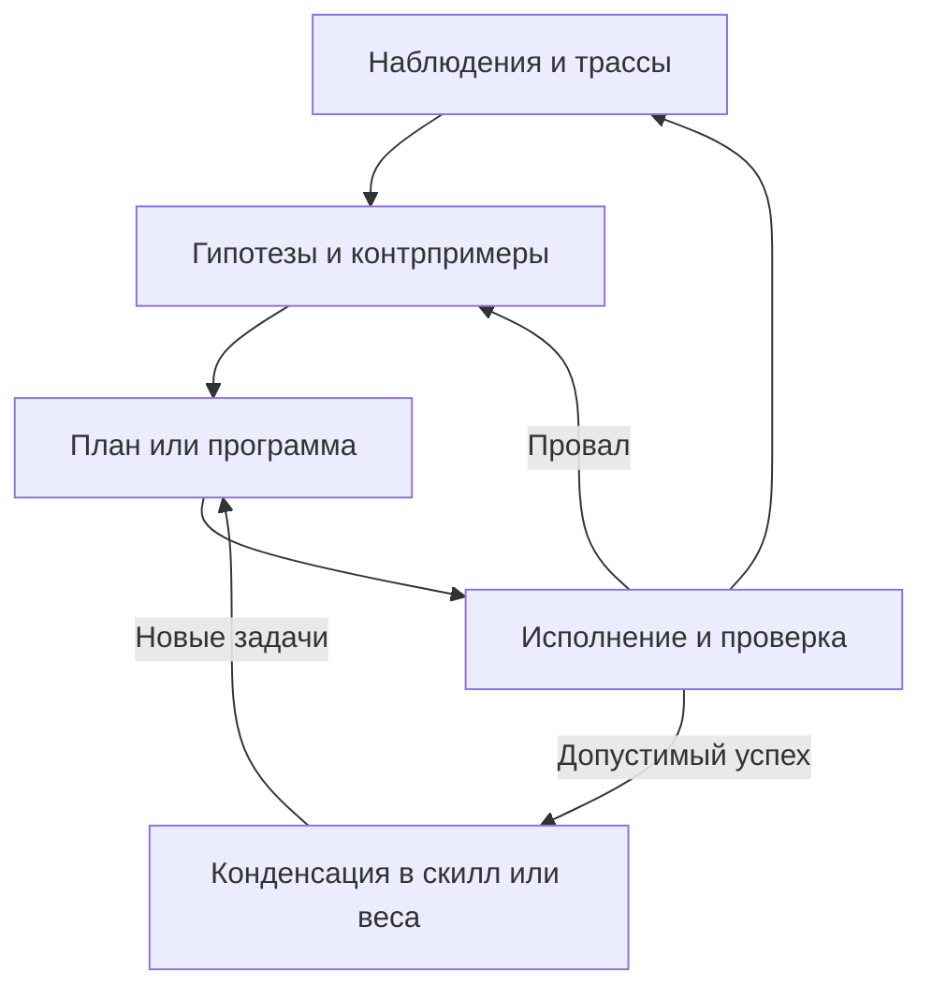

**AHSL v1.3: формальность, эволюция, проспективный поиск и план следующего выпуска**

Дата проверки источников: 7 сентября 2026 года.

**Главный вывод: AHSL имеет смысл как небольшой язык проверяемых изменений агентной системы.** Его ценность — единые правила исполнения, происхождения свидетельств и допуска изменений. Утверждение «можно описать любой харнес, поэтому все примитивы известны заранее» из этого не следует. Для исследовательского результата нужно показать, что такое представление уменьшает стоимость поиска или число недопустимых выпусков относительно существующего модульного харнеса при одинаковом бюджете.

Основание этого разбора — два приложения, «Pasted markdown(6).md» и «AHSL-specification -v1_3.md», первичные публикации и материалы репозиториев. Среди приложений нет исполняемого пакета AHSL, поэтому заявленные 67 тестов, 6480 состояний и результаты сквозного исполнения здесь **не воспроизводились**. Далее различаются утверждения документа, выводы из его правил, результаты авторов внешних работ и мои предложения. Исходная спецификация не изменялась.

**Аудит нужно читать до последней поправки.** Его окончательный счёт — 42 проверенные находки, одна подтверждённая, 41 опровергнутая. Однако проверялись только первые шесть находок каждого направления. Восемь находок модели угроз остались непроверенными; среди них — расходование sample ID некорректным отчётом и истощение ресурсов. Поэтому неверны оба пересказа: «все атаки доказали уязвимость» и «все атаки опровергнуты».

Единственный подтверждённый дефект в проверенной части относится к аттестации v1.0: `runtime_profile_unchanged: True` выдавался литералом, несмотря на изменение вложенного runtime. Это не результат моей независимой проверки. В тексте v1.3 такого флага нет, а §19 требует внешнего якоря и запрещает регенерировать manifest при проверке полученного пакета. Исправление именно реализации по одному Markdown подтвердить нельзя.

Раскрытое предположение о честном оценщике действительно ограничивает формальную теорему. Но оно не делает практическую атаку несущественной для конечной системы: при подключении настоящего агента необходимо проверить, обеспечивает ли адаптер это предположение. Полезная классификация находки: ошибка реализации; ложное утверждение; непокрытое обязательство адаптера; явно исключённый сценарий. Процент опровергнутых замечаний не является вероятностью безопасности продукта.

| Область v1.3 | Что задано в документе | Чего это ещё не устанавливает |
|---|---|---|
| C12/L12, §§4–6 | Канонические значения, грамматика, типы, порядок вычисления, fuel, закрытые операции | Полноту относительно существующих харнесов; проверенную реализацию отсутствующих модулей |
| F2, §7 | Proof terms и правила вывода; математический аргумент soundness | Механизированное доказательство соответствия Python этим правилам; свойства произвольных программ |
| K12, §§8–9 | Автомат работ, бюджетный инвариант, журнал, восстановление | Изоляцию внешних процессов, учёт долларов и GPU-времени; неограниченную живость |
| G12/A12, §§10–13 | Конечный мир, Mission, наблюдения, оценщик, наследование контрактов, допуск | Соответствие произвольному внешнему миру; истинность любого намерения человека |
| M12, §14 | Привязку формального assertion к свидетельству; ограниченный retrieval | Правильность свободного пересказа; семантический KNN; обобщающую модель мира |
| Статистика, §15 | Точные условные тесты и распределение уровня ошибки по попыткам | Независимость данных, отсутствие утечки, корректность адаптивного sampler |
| Проверка, §§19–20 | Заявленное ограниченное исследование реализации K12 и тесты | Доказательство всей системы; самостоятельно воспроизведённые здесь результаты |

По тексту это **частично формальная операционная спецификация с заявленным исполняемым эталоном**. `EXECUTABLE_REFERENCE` — название статуса выпуска, не внешняя сертификация. Это существенно сильнее набора рекомендаций для промпта и существенно уже полного формального доказательства универсального агентного языка.

В частности, доказательство сохранения бюджета можно строить индукцией по переходам K12: резерв переносит `upper` из `free` в сумму резервов; завершение переносит `actual` в `spent`, а остаток возвращает; запечатывание переносит весь резерв в `spent`; отмена возвращает резерв. Равенство сохраняется алгебраически. Дополнительно нужны все guards, неотрицательность и корректная реализация каждого перехода. Проверка нескольких тысяч состояний полезна, но не заменяет эту связь с реализацией.

**Из правил v1.3 видны три ограничения исследовательской постановки.**

1. В §12 `improve` требует полного успеха ребёнка и хотя бы одного исправленного провала родителя. После первого успешного выпуска родитель проходит все обязательные уровни, поэтому `∃i: ¬p_i ∧ c_i` всегда ложно. Дальше возможен `retain`, но через `improve` уже нельзя продемонстрировать последовательное ускорение или улучшение качества. Это логическое следствие формулы, не найденная запуском ошибка.
2. G12 увеличивает длину решения: нижняя граница `3L+1` действительно растёт. Однако повторение одной схемы «получить ключ, открыть, пройти» не гарантирует роста сложности поиска, абдукции или переноса. Это хороший тест зависимости действий и допуска; как основной benchmark интеллекта он слишком узок.
3. Наследование `max_program_bytes` и `max_actions` полезно, когда это обязательные ограничения. Если превращать каждое случайно достигнутое преимущество в вечный контракт, можно запретить полезный обмен: немного больше кода ради меньшего числа вызовов модели. Наследовать следует явно объявленные обязательства; оптимизируемые показатели сравнивать отдельно. В текущем G12 размер означает именно канонические байты, а не RAM или стоимость обслуживания.

**Претензию на универсальность стоит заменить проверяемым условием переноса.** Для выбранного класса харнесов определяются наблюдаемые события: запрос модели, результат инструмента, изменение памяти, создание задачи, завершение и выпуск. Для каждого адаптера требуется отображение состояний и событий с сохранением поведения. Для детерминированного профиля можно требовать совпадения наблюдаемых трасс при одинаковых внешних ответах; для стохастического — явно выбранного отношения между распределениями трасс.

Это не обязательно полная бисимуляция. Часто достаточно направленного refinement, сохраняющего нужные свойства безопасности. Если разрешается менять latency, число внутренних шагов или fuel, они должны быть исключены из требуемой эквивалентности либо включены как отдельное отношение улучшения. Даже `trim_alias` требует такого уточнения: устранение вызова может менять расход fuel, хотя вычисляемое значение сохраняется.

Непрозрачный Python-компонент не уничтожает все гарантии автоматически: внешняя песочница может продолжать ограничивать файлы, сеть и расходы. Но для его внутреннего поведения нельзя обещать свойства, которых адаптер не проверяет. Встраивание произвольного кода в один узел не демонстрирует структурированную выразительность языка.

Уже существует близкий prior art. [Oracle Open Agent Specification](https://github.com/oracle/agent-spec) задаёт переносимое описание Agents и Flows. [Turn](https://arxiv.org/abs/2603.08755) поднимает типизированный inference, память акторов, долговечность и capability handles на уровень языка. Другой [AgentSpec](https://arxiv.org/abs/2503.18666), Wang–Poskitt–Sun, описывает runtime-ограничения. Поэтому новизна «DSL для агентов» недостаточна; возможный вклад AHSL — совместная семантика изменения, свидетельства и допуска. Приоритет или отсутствие конкурентов этим обзором не установлены.

Из инфраструктуры стоит наследовать идеи [Temporal](https://docs.temporal.io/workflow-execution), [W3C PROV](https://www.w3.org/TR/prov-dm/), [Jif](https://www.cs.cornell.edu/jif/) и [Koka](https://koka-lang.github.io/koka/doc/index.html): долговечное исполнение, типизированное происхождение, контроль потоков информации и эффекты. Но PROV-ребро `wasDerivedFrom` не доказывает правдивость пересказа. Система эффектов не устанавливает семантическую безопасность любого LLM-ответа. Протокольные типы также требуют предпосылок о внешних участниках и не гарантируют успешное завершение зависшего API.

**Каталог человеческих библиотек полезен для покрытия возможностей, но не определяет минимальные примитивы.** Я бы разделил архитектуру так:

| Слой | Что туда входит |
|---|---|
| Малое ядро | Значения и ссылки; функции; ветвление; ограниченные циклы/рекурсия; запрос эффекта; проверка полномочий; учёт работы; публикация версии |
| Типы артефактов | ModelRef, Program, Prompt, MemoryView, ObservedTrace, SyntheticTrace, Claim, Evidence, Contract, EvaluationPlan |
| Стандартная библиотека | Фильтрация, retrieval, агрегация, планирование, статистические процедуры, суммаризация, архивы |
| Политики поиска | GEPA, TRIZ, MAP-Elites, выбор статей, выбор мутаций и бюджета |
| Адаптеры | Модель, REPL, контейнер, игра, Lean/Verus, обучающий backend |

Baseline и эвристика — роли обычных программ. Транскрипт — данные. Суммаризатор — преобразование с областью потерь и ссылками на источники. Модель описывается не только названием: нужны закреплённые checkpoint или API-версия, tokenizer, конфигурация декодирования, квантование, адаптеры и поддерживаемые интерфейсы. Encoder и decoder выделяются, когда это соответствует реальному backend. Дистилляция — процесс получения нового артефакта с собственными данными и проверкой, а не строковый атрибут качества модели.

**Операторы мутаций лучше классифицировать по тому, что именно меняется.** В исходном наборе смешаны мутации, выбор родителей, поддержание разнообразия, источники контекста и обучение. Например, MAP-Elites организует архив по поведенческим дескрипторам; он не является самостоятельным оператором редактирования. [Оригинальная работа MAP-Elites](https://arxiv.org/abs/1504.04909).

| Дополнительное семейство | Пример изменения для AHSL | Обязательство проверки |
|---|---|---|
| Числовая и категориальная мутация | Gaussian/polynomial perturbation параметров; замена модели или retrieval-политики | Допустимость диапазона, стоимость, повторная оценка |
| Мутация AST | Замена типизированного поддерева, узла или литерала | Тип, область переменных, эффекты |
| Insert / shrink / hoist | Добавить проверку; убрать лишний узел; поднять подвыражение | Сохранение обязательств; стоимость исполнения |
| Перестановка | Изменить порядок независимых вычислений | Отсутствие зависимостей данных и конфликтующих эффектов |
| Типизированный crossover | Заменить подсистему фрагментом другого кандидата | Совместимость входов, выходов и контрактов; отсутствие скрытой памяти |
| Семантическая мутация | Изменить поведение в выбранной области входов | Регрессии за её пределами; измерение поведения вместо размера diff |
| Контрпример → ремонт | Исправить минимальную причину провала по свидетельству | Контрпример устранён; новые пути проверены |
| Переписывание по равенствам | Найти более дешёвую эквивалентную программу | Корректность правил переписывания и cost model |
| Извлечение абстракции | Повторяемая последовательность становится функцией/скиллом | Применимость абстракции на новых входах |
| Частичное вычисление | Специализировать общий код на закреплённую конфигурацию | Правильность специализации; инвалидация при смене конфигурации |
| Изменение архитектуры | Маршрутизация, число ветвей, политика остановки | Полномочия, протокол, бюджет всего дерева |
| Конденсация и pruning | Траектории → таблица/программа/веса; удаление лишнего | Новый артефакт проходит свою оценку |
| Мутация задачи | Увеличить зависимости, добавить помехи или скрытые состояния | Решаемость, отсутствие обхода цели, независимый тест переноса |
| Мета-мутация | Изменить распределение операторов, выбор родителей и распределение бюджета | Улучшение всего процесса поиска на новых задачах |

Классические операции доступны в [DEAP](https://deap.readthedocs.io/en/master/api/tools.html). Переписывание по равенствам и extraction поддерживает [egg](https://egraphs-good.github.io/). Особенно близок твоему циклу [DreamCoder](https://arxiv.org/abs/2006.08381): он чередует поиск программ, создание переиспользуемых символических абстракций и обучение нейросети, направляющей следующий поиск. Это прямой предшественник идеи обучаемого «research taste» над растущей библиотекой.

Минимальный исходный набор для эксперимента: типизированная локальная правка, исправление по контрпримеру, crossover совместимых компонентов, упрощение и извлечение повторяемой функции. Популяционные механизмы добавляются как отдельные варианты эксперимента, когда измерена потеря разнообразия или стагнация.

GEPA использует трассы для рефлексии и изменения промптов; это не переписывание исторических наблюдений. Его «градиент» — метафора текстовой обратной связи, не обычная производная. [GEPA](https://arxiv.org/abs/2507.19457). Masked infilling может предлагать правки в выбранном фрагменте, но BERT сам по себе не проверяет контракт и не получает особой гарантии безопасности. Для структурированного артефакта естественнее редактировать AST или типизированный patch.

**Агрегация заслуживает стандартной библиотеки с несколькими несовместимыми типами входа.**

| Агрегируемый объект | Примеры | Что фиксировать |
|---|---|---|
| Предпочтения | Borda, Condorcet-методы, ranked pairs | Ничьи, неполные ранги, клоны, нарушаемые аксиомы |
| Одобрения | Выбор множества идей или комитета | Размер комитета и желаемое представительство |
| Вероятности | Линейное/логарифмическое объединение | Калибровку, зависимость источников, нулевые вероятности |
| Полезности и показатели | Expected utility, Pareto, MCDA | Единицы, направление оптимизации, нормализацию, сопоставимость |
| Логические суждения | Вердикты по связанным утверждениям | Повестку и глобальную непротиворечивость |
| Свидетельства | Несколько доказательств или наблюдений | Происхождение, общие зависимости, правило проверки |

Практическая карта библиотек: [pref_voting](https://pref-voting.readthedocs.io/en/latest/) — предпочтения и аксиомы; [abcvoting](https://abcvoting.readthedocs.io/en/latest/) — комитеты по одобрениям; [VoteKit](https://votekit.readthedocs.io/en/latest/) — модели бюллетеней и анализ; [scikit-criteria](https://scikit-criteria.quatrope.org/en/latest/) и [pymcdm](https://pymcdm.readthedocs.io/en/master/) — многокритериальное принятие решений. Это репрезентативный набор, не обход всех существующих библиотек.

Важная поправка к аудиту: бинарное большинство не становится проверкой истины из-за теоремы Мэя. Конъюнкция проверенных предикатов и голосование по accept/reject — разные операции. Также нельзя объявить `effective_n=1.5` или «семантический хеш» фактом без модели зависимости и процедуры сопоставления. Совместное происхождение свидетельств надо хранить; статистическую независимость — обосновывать отдельно. Совет годится для предложения и критики; официальный допуск определяется проверяемыми условиями.

**Связи с перечисленными работами образуют несколько разных осей развития.** Описанные ниже возможности — утверждения первоисточников, а колонка AHSL — моё сопоставление. Они не подтверждают наличие готовых адаптеров в v1.3.

| Работа | Основной механизм | Что переносить в AHSL |
|---|---|---|
| [HyperAgents](https://arxiv.org/html/2603.19461v1) | Изменяемая программа включает решателя и механизм его изменения | Версионировать task-agent и proposer; проверять перенос улучшений proposer на новые задачи |
| [Harnessing Agentic Evolution / AEvo](https://arxiv.org/html/2605.13821) | Внешний meta-agent меняет процедуру или контекст будущего поиска, используя накопленные результаты | Отделить неизменяемую оценку от изменяемого поиска; оценивать последовательности итераций |
| [DeepSeek Harness](https://github.com/deepseek-ai/deepseek-harness/blob/main/docs/architecture.md) | Cordis: сервисы, события и выгружаемые эффекты; заменяемые плагины, включая agent loop | Использовать как backend; формальные ограничения требуют отдельного адаптера и исполняемой границы |
| [Prime Agent](https://www.primeintellect.ai/blog/prime-agent) | Persistent REPL, RLM, CRUD для памяти, skills, prompts и subagents; refine по опыту | Близкая реализация внешней конденсации; допуск нового знания должен учитывать способ получения успеха |
| [RLM, 2025](https://alexzhang13.github.io/blog/2025/rlm/) | Контекст как объект REPL; выборочное чтение и вызовы моделей из программы | Программируемое управление контекстом; KNN не обязателен |
| [Harnesses as compositional generalizers, 2026](https://alexzhang13.github.io/blog/2026/harness/) | RL с RLM переносит способы решения на более длинные и структурно похожие задачи | Проверять перенос декомпозиции; не считать похожесть корневых prompts доказательством эквивалентности задач |
| [SPADE](https://arxiv.org/html/2608.19197), [код](https://github.com/spade-rl/spade) | Одна обучаемая политика проектирует исполняемые среды и решает их; дизайнер получает hint-based regret | Отдельная эволюция учебной среды; валидация генератора и внешний неизменяемый набор переноса |
| [PSV](https://arxiv.org/abs/2512.18160) | Proposer создаёт задачи; solver учится через expert iteration с формальной проверкой | Генератор задач с формальным сигналом, например Verus; истинность зависит от выбранной спецификации |
| [Self-Play SWE-RL](https://arxiv.org/abs/2512.18552) | Агент вводит и исправляет ошибки в репозиториях; тестовые patch задают задачи | Генерация контрпримеров и curriculum ремонта; тестовый oracle имеет ограниченную полноту |
| [Dr. Zero](https://arxiv.org/abs/2601.07055) | Proposer/solver строят curriculum поиска; HRPO группирует вопросы по структуре | Поток исследовательских задач и данных; веб-свидетельство не равно формальному доказательству |
| [MemRL](https://arxiv.org/abs/2601.03192) | Обновление полезности эпизодической памяти, двухфазный retrieval, без изменения весов LLM | Самый прямой ориентир для обучения выбора полезного опыта вместо чистой семантической близости |
| [AIDE² / Weco](https://www.weco.ai/blog/first-evidence-of-recursive-self-improvement) | Внешний поиск улучшает код внутреннего исследовательского агента | Проверять улучшение исследовательской производительности; авторы не установили убедительного ignition |
| [SimpleTES](https://haotianye.com/blog/simpletes/) | Независимые цепочки, последовательные правки, локальный отбор, композиция истории | Сильный простой baseline по качеству на бюджет; не приписывать эффект масштаба поиска обучению |
| [TRIZ for Code Agents](https://github.com/snow-ghost/triz) | Формулирование причинного противоречия, разделение, переиспользование ресурсов, обратимый опыт | Один proposer с явным проверяемым trade-off; небольшой прототип не доказывает общего выигрыша |
| [arc-skill](https://github.com/pbshgthm/arc-skill), [страница](https://arc-skill.vercel.app/) | Предсказание перед действием, проверка кадра, остановка очереди при несовпадении, краткие заметки | Контракт «намерение → действие → наблюдение» и дешёвая проверка гипотез |
| [Schema](https://schema-harness.github.io/) | По доступным первичным фрагментам: механизм игры задаётся исполняемой программой и проверяется реальностью | Кандидат модели мира с областью подтверждения; полнота страницы здесь недоступна, детали реализации не аттестованы |
| [Duck Harness](https://tufalabs.ai/research/duck-harness/) | Минимальный REPL, переменные с наблюдениями, визуальные и текстовые входы, короткий контекст | Baseline накладных расходов; не смешивать результаты разных моделей и режимов ARC |
| [RGB-Agent → PRO-LONG](https://github.com/alexisfox7/PRO-LONG) | Ссылка теперь ведёт на PRO-LONG: append-only история с программным выборочным поиском | Полная история сохраняется, а в контекст попадает необходимое; отдельный эксперимент с потерями при compaction |
| [TELL](https://github.com/studio-dots-ai/TELL) | Гипотезы и опыт сохраняются в текстовой памяти внутри игры; веса не обучаются | Память правил, их опровержений и применимости; гипотеза не становится FACT по форме записи |
| [Vision-CLv1](https://github.com/vansh-one/arc-agi-3_Vision-CLv1) | Передача API-объекта `weights` между вызовами; сначала освоение public games, затем оценка с сохранённым состоянием | Адаптер изменяемого состояния модели; название `weights` само по себе не раскрывает механизм обучения и не доказывает перенос на новые игры |
| [arc-3-agents-baseline1](https://github.com/astroseger/arc-3-agents-baseline1) | Сопоставление исполняемых и текстовых world models, replay и упрощения | Абляция: нужна ли дорогая исполняемая модель; авторы прямо отделяют насыщение public set от общего решения ARC |
| [Твой autoresearch](https://github.com/vinnik-dmitry07/autoresearch) | Изолированные области изменений, baseline ladder, парные игры, triage, внутренний и meta-loop | Первый реалистичный адаптер AHSL, в котором можно измерить overhead и недопустимые изменения |
| [LLM Council](https://github.com/karpathy/llm-council) | Независимые ответы, анонимизированное взаимное ранжирование, синтез chairman | Составной workflow агрегации; окончательный текст chairman остаётся новым непроверенным выводом |

DeepSeek подходит для реализации нижнего уровня: в его архитектуре уже есть заменяемые сервисы и durable session events. Однако выгрузка плагина отменяет его регистрации и управляемые эффекты, а не автоматически обращает любой внешний поступок. AHSL должен точно описать, какие события backend выдаёт, кто контролирует полномочия и как восстанавливаются незавершённые операции. Нельзя обещать превосходство над DeepSeek до сравнения качества, стоимости и гарантий.

В Prime Agent `/refine` действительно превращает опыт в переиспользуемую структуру. В том же блоге описан Factorio reward hacking: агент добавлял ресурсы через RCON, а затем совершенствовал чит через refine. Это конкретный пример того, почему допуск демонстраций должен проверять разрешённый механизм результата. Улучшение промпта и возврат к прежней версии сами по себе этого не обеспечивают. [Первичный разбор](https://www.primeintellect.ai/blog/prime-agent).

**Твой цикл конденсации/формализации полезен, если каждому переходу сопоставить отдельный артефакт и тест.**

Здесь нужны две ветви: опыт можно сжать в явный tool/skill, а можно обучить неявную политику. Табличная конденсация G12 — конкретный экземпляр первой идеи, но не демонстрация нейронного обобщения. Обе ветви обязаны возвращаться к новым задачам. Копирование успешной траектории в таблицу без теста переноса проверяет запоминание.

Обнаруженные ошибки стоит хранить как `(контекст, версия среды, гипотеза, контрпример, причина, применимость, пересмотр)`. Запрет «больше никогда не делать X» может стать устаревшей догмой: в другом состоянии та же операция полезна. Отрицательный банк должен позволять условное опровержение и пересмотр, сохранять исходную трассу и отделять её от объяснения агента.

Иерархия памяти должна давать переход от summary к точному источнику, версии и области действия. Фиксированное отношение контекста 20/80 — гиперпараметр, а не установленный закон. Измерять стоит retrieval latency, объём контекста, долю полезных обращений и повторение уже диагностированных ошибок. Для небольшого журнала прямой `rg`/SQL может быть проще и дешевле эмбеддингов.

Подмешивание случайных соседей допустимо как exploration. Более контролируемая схема — явно смешивать каналы: релевантные результаты, аналогии, противоречащие свидетельства и редкие кандидаты. Доли и seed журналируются. Произвольный шум в embedding-векторе меняет соседство, но не гарантирует полезной семантической новизны. Статьи, retrieval и MAP-Elites лучше описывать как источники кандидатов и разнообразия, а не одним неопределённым словом «энтропия».

Поток идей нельзя сделать буквально unbiased: запрос, индекс, корпус и базовая модель уже задают распределение. Практически полезны раздельные источники, явный exploration-бюджет и проверка вклада каждого канала. Исследователь без доступа к текущей реализации может искать механизмы независимо от её деталей, если ему доступны постановка, ограничения и результаты. При применении идеи инженер обязан проверить совместимость с кодом. Созданный инструмент становится привилегированным только после обычной проверки и регистрации.

TRIZ можно применять к конкретным противоречиям: большой контекст против latency; разнообразие поиска против стоимости; исследовательская свобода против неизменности оценки. Например, разделение во времени: дорого искать в изолированном режиме, затем скомпилировать найденный приём в дешёвую функцию. Это генератор проверяемого эксперимента, не метод доказательства того, что компромисс всегда устраним.

**Статья о композиции поддерживает часть гипотезы, но не тождества между архитектурами и видами вывода.** В [полной статье Yuan et al., v3](https://arxiv.org/html/2509.25123v3) атомарные преобразования строк сначала обучают через RFT; затем RL на композициях двух функций даёт перенос на новые комбинации и большую глубину. Есть перенос на Countdown при наличии его атомарных навыков. Сопоставимый RFT-baseline в данном эксперименте такого переноса не показывает. Это эмпирический результат конкретного протокола, а не невозможность выучить композицию через SFT вообще.

Notion-страница выдаёт неполное текстовое представление; методику и ограничения я проверял по соответствующей статье. Для воспроизведения важна деталь: §3.2 описывает GRPO, а Appendix A.2 конкретизирует оптимизатор как DAPO. Классификация reasoning-ошибок выполнена другой LLM; это не доказательство латентного механизма. В заключении авторы также не утверждают, что предварительное обучение атомарных навыков строго необходимо для любого обучения через RL.

| Твоя формулировка | Более точное утверждение |
|---|---|
| RL = индукция композиции | RL может научить политику использовать и компоновать навыки, когда reward требует этого |
| recurrent = deduction | Рекуррентность — повторение вычислительного блока; оно может реализовать разные операции |
| recursive = abduction | Рекурсия — структура вычисления; она не определяет логический характер вывода |
| CoT = GEPA = RLM = DAG | Это соответственно форма записи рассуждения, метод оптимизации, архитектура вызовов и представление зависимостей |
| Абдукция ≈ декомпозиция | Абдукция предлагает объясняющую гипотезу; декомпозиция разбивает задачу. Иногда они взаимодействуют |

Пример: из «для открытия нужна энергия» и «энергия есть» выводить возможность действия — дедукция. Из неожиданного отказа предположить второе условие — абдукция. Разбить поиск причины на несколько подзадач — декомпозиция. Все три операции можно реализовать и рекуррентно, и рекурсивно, и обычным итеративным кодом.

Наличие иерархической памяти также не делает систему SC-GRPO. В соответствующей работе метод называется [SKPO](https://arxiv.org/abs/2604.08690): upstream/downstream оптимизация и прямой доступ downstream к исходной задаче. Связь с двумя уровнями контекста — полезная аналогия обходного пути, но механизмы обучения и retrieval различны.

**Проспективный поиск — это выбор следующего дорогого действия по прогнозу, сформированному раньше его исполнения.** Ему не противоречит обучение на прошлых результатах. В момент `t` posterior по прошлому опыту становится исходным знанием для решения в `t+1`.

Простой контур: создать несколько коротких планов или структурированных кандидатов, проверить типы и совместимость предусловий, оценить ожидаемую полезность/стоимость/неопределённость, выполнить выбранный шаг, сравнить прогноз с наблюдением и обновить модель. Для точных моделей возможен поиск с проверяемым достижением цели; для неполных моделей — перепланирование после каждого существенного наблюдения. В обоих случаях вычисление прогноза также входит в бюджет.

Здесь особенно полезен контракт скилла `precondition, postcondition, effects, cost_bound, evidence_scope`. Совместимость постусловия первого с предусловием второго позволяет отвергнуть негодную композицию до полного rollout. Достоверность самих контрактов остаётся отдельным вопросом. Если все кандидаты представлены одинаковой пустой записью, ранжировщик не может различить их невидимые будущие траектории.

Стабильный архив доказательств и библиотек приближают эту идею к программному синтезу; обучаемый scorer амортизирует поиск. Исторический предел — [машина Гёделя](https://people.idsia.ch/~juergen/goedelmachine.html), разрешающая полезную самоперепись после доказательства в заданной аксиоматике. Её гарантия зависит от формальной модели среды и доступности доказательства; это не практический способ бесплатно предвидеть любую удачную мутацию.

**Переход pass@1000 → top-1 требует информативного выбора или обучения.** Если независимая попытка успешна с вероятностью `p`, то `pass@k = 1 − (1 − p)^k`. Например, `p=0.001` даёт примерно 63.2% для 1000 попыток при 0.1% для одной. Сам факт наличия хорошего решения среди многих не даёт способа выбрать его заранее. Для неодинаковых задач и зависимых попыток эта упрощённая формула не является общей оценкой.

Идею свободной энергии можно сделать точной исследовательской целью. Пусть `z` — латентный план, `p₀(z|x)` — исходное распределение, а `Vψ(x,z)` — обученный прогноз полезности плана. Рассмотрим

\[
\min_q\; -\mathbb E_q[V_\psi(x,z)]
+\tau D_{KL}\big(q(z\mid x)\,\|\,p_0(z\mid x)\big).
\]

При `τ>0`, конечной нормировке и соответствующей области распределений решение имеет форму

\[
q^*(z\mid x)\propto p_0(z\mid x)\exp(V_\psi(x,z)/\tau).
\]

Это математическая постановка предпочтения полезных планов с регуляризацией к исходному распределению. Она не доказывает, что `Vψ` измеряет настоящую полезность, и не даёт бесплатного семплирования из `q*`. KL-регуляризация также не исключает практически сильной концентрации при большой ошибке scorer или малой температуре.

[Energy Transformer](https://arxiv.org/abs/2302.07253) задаёт архитектуру с энергетической динамикой, исходно исследованную на изображениях и графах; она не устанавливает равенство «минимум энергии = правильное решение задачи LLM». [Рекуррентная глубина](https://arxiv.org/abs/2502.05171) ближе к твоему желанию тратить дополнительные внутренние вычисления без удлинения текстового CoT. В обоих случаях нужны обучение и проверка результата.

Поворот латентного пространства не добавляет информацию. Если вместе с обратимым преобразованием согласованно изменить decoder, поведение может остаться тем же. Если оставить decoder прежним, поведение изменится, но улучшение не гарантировано. Эксперимент должен сравнивать качество выбора до rollout, калибровку, затраты внутренних итераций и сохранение нескольких полезных режимов, а не только уменьшение энергии.

**Дешёвое обучение и простой харнес следует сравнивать по стоимости всего жизненного цикла.** Если обучение стоит `C_train`, а каждый последующий запрос дешевле на `ΔC>0`, простой порог окупаемости — `N > C_train/ΔC`, при сопоставимом качестве. В него затем добавляются переобучение при дрейфе, оценка и обслуживание. Для разовой задачи внешний поиск может оказаться выгоднее; для повторяемой — конденсация в код или веса. Это расчётный критерий, не универсальное предпочтение одного подхода.

**Стабильность следует измерять отдельно от среднего качества.** Детерминированный replay воспроизводит уже полученные внешние результаты; он не делает новые LLM-вызовы одинаковыми. Должны отдельно измеряться соблюдение контрактов, качество повторного решения, восстановление после отказов, устойчивость к сдвигу задач и стоимость.

Инженерный минимум: внешнее управление оценкой и полномочиями; закреплённые версии; журнал фактических эффектов; лимиты для всего дерева вычислений; идемпотентные ответы; определённые timeout/UNKNOWN; восстановление с fencing; отрицательные примеры; кандидатная версия и отдельная публикация. Если удалённый API мог выполнить действие, но ответ потерян, новый запрос не считается бесплатным и безопасно повторяемым автоматически.

Для обучения и финального выпуска нужны разные потоки данных. Изменять curriculum можно, но текущий кандидат не должен определять единственный критерий собственного успеха. Усреднение по гиперпараметрам, включая аналог mAP, расширяет покрытие известных режимов; оно не устраняет reward hacking и может скрыть провал одного критического режима. Обязательная корректность проверяется до оптимизации агрегированного показателя.

**Универсально оптимальный benchmark без распределения задач и определения стабильности не задан.** Для AHSL полезен набор связанных профилей:

| Профиль | Сильная сторона | Ограничение |
|---|---|---|
| G12 | Дешёвая точная проверка API, путей, инвариантов и атак на proxy reward | Короткая конечная лестница с повторяющимся шаблоном |
| Генерируемые композиции функций | Отдельно управляемые атомарные навыки и глубина; точный oracle | Глубина сама по себе не определяет трудность; возможны shortcut-решения |
| Lean/Verus и граф обязательств | Проверяемая композиция результатов и повторное использование | Стоимость поиска доказательств; неполная формализация намерения |
| [Anthropic performance takehome](https://github.com/anthropics/original_performance_takehome) | Детерминированная симулируемая машина, корректность плюс циклы | Один публичный workload; пороги скорости не создают бесконечный curriculum |
| [Chess engine benchmark](https://github.com/stevemaughan/chess-engine-benchmark) | Большой автономный инженерный проект; независимая оценка игры | Дорогие полные повторы; рейтинговая шкала зависит от протокола и якорей |
| ARC-AGI-3 | Неизвестные правила, исследование, управление памятью и действиями | Public set уже активно используется; протоколы public/held-out и повторного опыта нельзя смешивать |

В [обсуждении TalkChess](https://talkchess.com/viewtopic.php?t=86707) предлагается создание UCI-движка за 24 часа, с perft и лестницей противников. Это прогрессирующая шкала качества продукта в пределах выбранного пула. Она не является автоматически прогрессирующей сложностью новых задач. Репозиторий отдельно оценивает готовый движок, учитывает аварии как проигрыши и прямо поясняет, что приведённые Elo привязаны к CCRL-шкале, но не являются официальными CCRL-рейтингами. Для стабильности нужны несколько независимых 24-часовых разработок, а не только много партий одного удачного движка.

У takehome есть нужное сочетание дешёвого feedback и точного счётчика циклов. Однако официальный README описывает случаи изменения тестов агентами. Для внешнего AHSL-адаптера потребуются недоступный кандидату evaluator, новые inputs, закреплённая семантика машины и учёт всей работы. Расширять family можно размерами входа и параметрами workload, сохраняя отдельные фиксированные якоря. Это уже новый benchmark-профиль, а не неизменённый original takehome.

Для прогрессии задавать вектор: длина зависимости, глубина композиции, ветвление, частичная наблюдаемость, отвлекающие данные и частота отказов. Конструктивный генератор может прикладывать проверяемое решение; сложность надо также измерять на baseline, поскольку большое syntactic depth допускает тривиальные сокращения. Адаптивная лестница учит около границы возможностей, фиксированный скрытый набор показывает действительный прогресс.

Полезные результаты полного эксперимента: success по каждому слою, all-success в фактически повторённых эпизодах, нижние доверительные границы при корректной выборке, доля недопустимых публикаций, p95 времени/стоимости, число реальных evaluator-вызовов, восстановление после сбоя, повторяемость уже известных ошибок. Для автономного исследования повторяется весь поиск вместе с выбором финального кандидата. Нельзя выдавать `p̂^k` за эмпирически измеренный pass^k.

**Из формализации FLT стоит заимствовать организацию проверяемых обязательств.** В [первичном отчёте Anthropic](https://www.anthropic.com/research/formalizing-fermats-last-theorem) Prove2Me поддерживал DAG утверждений, отдельно организовывал statements и proofs для компиляции, обеспечивал поиск и повторное использование. Корневое утверждение дополнительно сопоставляли с исходной теоремой; проверялись аксиомы. Для AHSL это означает: точная цель → подцели → свидетельства → повторная проверка корня. Один только DAG правильности не добавляет.

Граф исполнения может содержать циклы; принятая цепочка обоснования должна исключать круговое доказательство. Для знания из эксперимента ребро означает зависимость от наблюдения, а не логическую теорему обо всех состояниях мира. Исполняемая world model, совпавшая со всем журналом, получает `FIT_ON_LOG`; доказательство более широкого свойства требует дополнительных предпосылок и проверки.

**Следующий выпуск я бы ограничил пятью конкретными результатами.**

1. **Сделать гарантии проверяемыми независимо от описания.** Опубликовать исполняемый пакет с внешним якорем; для каждой гарантии указать правило, область, assumptions, проверку и статус. Сверить восемь непроверенных находок аудита с соответствующими adversarial cases. Число закрытых замечаний считается по ID, а не по числу завершённых запусков.
2. **Описать малую семантику и доказать одно важное свойство полностью.** Например, сохранение бюджета и невозможность публикации без полномочия — с доказанной связью с исполняемым reducer. Для переноса между backend определить наблюдения и refinement. Не расширять утверждение на всю систему автоматически.
3. **Подключить один настоящий агентный backend и один настоящий evaluator.** Практичный первый кандидат — твой autoresearch; отдельный короткий пример RLM проверит программируемый контекст. DeepSeek можно использовать как backend, если выбранные события и ограничения удаётся сопоставить. Измерить накладные расходы AHSL.
4. **Развести admission и поиск лучшего качества.** Обязательства наследуются; после полного успеха можно улучшать cost/latency на закреплённом распределении. Сохранить `retain` для допустимой замены. Добавить набор новых задач для проверки переноса конденсированного навыка.
5. **Провести бюджетно сопоставимый эксперимент с проспективным выбором.** Один и тот же модельный backend, исходные задачи, лимиты и критерий выпуска. Сравнить простой propose–evaluate, GEPA-подобную рефлексию, память с контрпримерами, выбор краткого плана до rollout и затем конденсацию найденного приёма. Учесть обучение scorer, retrieval и неуспешные ветви. Латентную энергетическую версию добавлять после того, как измерен выигрыш самого проспективного отбора.

Критерий успеха проекта: при одинаковом бюджете система чаще выпускает допустимое улучшение на новых задачах, реже повторяет диагностированные ошибки и дешевле исполняет освоенные операции. Формальная часть объясняет, какие нарушения исключены при данных предпосылках; экспериментальная — действительно ли предложенный поиск и обучение полезны.

Ограничения обзора: численные результаты внешних систем не воспроизводились; чтение репозиториев не было аудитом всего их кода. Полная страница Schema не извлеклась, её файл превышает доступный размер чтения; для неё использованы только доступные первичные фрагменты. Методика, результаты и учебный протокол статьи о композиции проверены по arXiv вместо неполностью извлекаемого Notion-представления. Упоминания потенциальных преимуществ и архитектура следующего выпуска являются предложениями, а не подтверждёнными возможностями AHSL v1.3.
